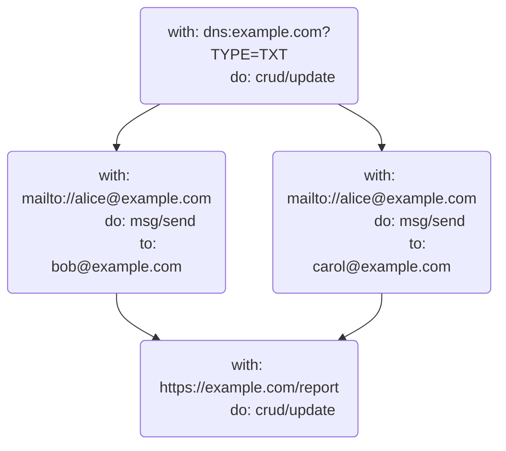
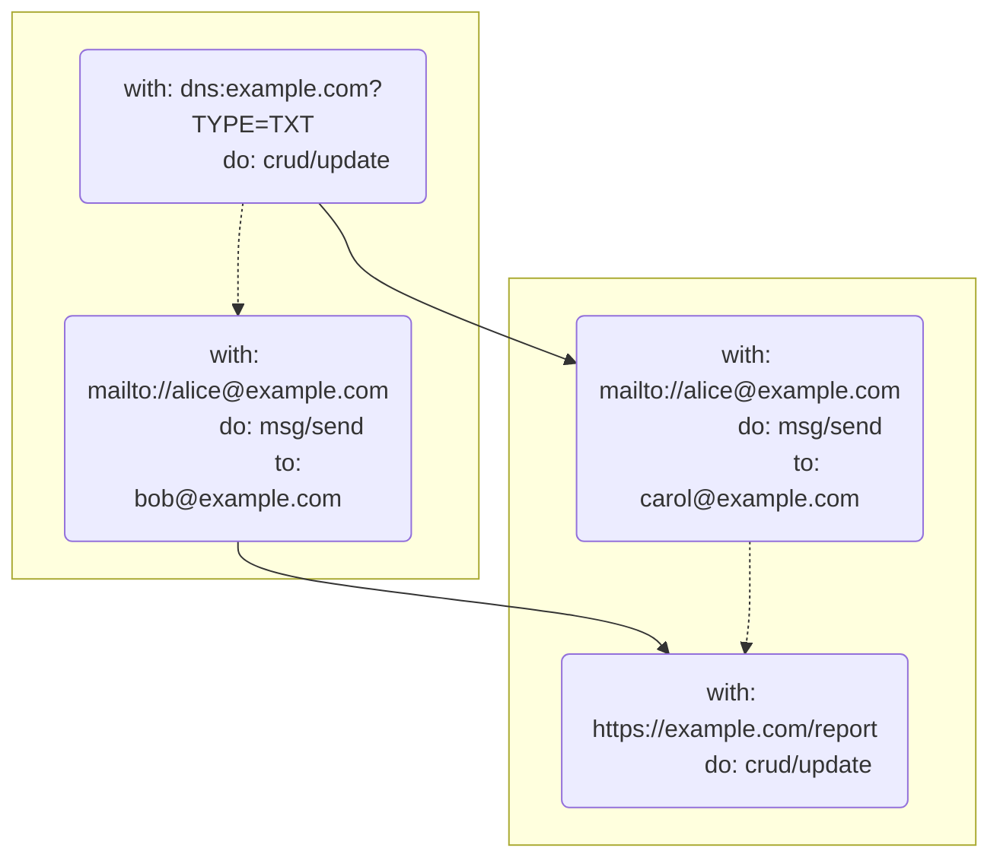

# UCAN Promise Pipelines


Later, when we explore promise [pipelines], this also includes capturing the promise:

```json
{
  "bafy...getMailingList": {
    "on": "https://exmaple.com/mailinglist",
    "call": "crud/read"
  },
  "bafy...sendEmail": {
    "on": "mailto://alice@example.com",
    "call": "msg/send",
    "input": {
      "to": {
        "await/ok": {
          "/": "bafy...getMailingList"
        }
      },
      "subject": "hello",
      "body": "world"
    }
  }
}
```

```js
// Pseudocode
const mailingList = crud.read("https://exmaple.com/mailinglist");
const sendEmail = msg.send("mailto://alice@example.com", {
  to: mailingList.await().ok,
  subject: "hello",
  body: "world"
});
```


```ipldsch
type Closure = Task # Allows promises

# Way to reference result of the Task
type Await union {
  | &Task    "await/*"
  | &Task    "await/ok"
  | &Task    "await/error"
} representation keyed
```


# 9 Pipelines

> Machines grow faster and memories grow larger. But the speed of light is constant and New York is not getting any closer to Tokyo. As hardware continues to improve, the latency barrier between distant machines will increasingly dominate the performance of distributed computation. When distributed computational steps require unnecessary round trips, compositions of these steps can cause unnecessary cascading sequences of round trips
>
> — [Mark Miller](https://github.com/erights), [Robust Composition](http://www.erights.org/talks/thesis/markm-thesis.pdf)

There MAY not be enough information to described an Invocation at creation time. However, all of the information required to construct the next request in a sequence MAY be available in the same Batch, or in a previous (but not yet complete) Invocation.

Some invocations MAY require input from set of other invocations. Waiting for each request to complete before proceeding to the next task has a performance impact due to the amount of latency. [Promise pipelining](http://erights.org/elib/distrib/pipeline.html) is a solution to this problem: by referencing a prior invocation, a pipelined invocation can direct the executor to use the output of one invocations into the input of the other. This liberates the invoker from waiting for each step.

An `Await` MAY be used as a variable placeholder for a concrete value in a [Task] [Invocation] output, waiting on a previous step to complete.

For example, consider the following invocation batch:

```json
{
  "bafy...createBlogPostTask": {
    "on": "https://example.com/blog/posts",
    "call": "crud/create",
    "input": {
      "payload": {
        "title": "How UCAN Tasks Changed My Life",
        "body": "This is the story of how one spec changed everything..."
      }
    }
  },
  "bafy...getBlogEditorsTask": {
    "on": "https://example.com/users/editors",
    "call": "crud/read"
  },
  "bafy...sendEmailTask": {
    "on": "mailto:akiko@example.com",
    "call": "msg/send",
    "input": {
      "to": {
        "await/ok": {
          "/": "bafy...getBlogPostEditorsTask"
        }
      },
      "subject": "Coffee",
      "body": {
        "await/ok": {
          "/": "bafy...createBlogPostTask"
        }
      }
    }
  },
  "bafy...sendEmailInvoctaion": {
    "v": "0.1.0",
    "run": {
      "/": "bafy...sendEmailTask"
    },
    "auth": {
      "/": "bafy...auth"
    },
    "prf": [
      {
        "/": "bafy...proofUcanOutsideExample"
      }
    ]
  },
  "bafy...auth": {
    "scope": [
      {
        "/": "bafy...sendEmailTask"
      },
      {
        "/": "bafy...getBlogPostEditorsTask"
      },
      {
        "/": "bafy...createBlogPostTask"
      }
    ],
    "s": {
      "/": {
        "bytes": "7aEDQDEGkezG7Bcpeknf2UJ7hpqeL1PZodrYYTSwRjqZPf67P4r1lRZvX+6+9gV+wDZUX0DZLMv64n2fPKnjvxrEugE"
      }
    }
  }
}
```

By analogy, above examples can be interpreted roughly as follows:

```js
const createDraft = crud.create("https://example.com/blog/posts", {
  payload: {
    title: "How UCAN Tasks Changed My Life",
    body: "This is the story of how one spec changed everything...",
  },
})

const getEditors = crud.read("https://example.com/users/editors")

const notify = msg.send("mailto:akiko@example.com", {
  to: (await createDraft).ok,
  subject: "Coffee",
  body: (await getEditors).ok,
})
```

Any [Task] field other besides `do` MAY be substituted with `Await`. The `do` field is critical in understanding what kind of action will be performed and CAN NOT be substituted with `Await`.

An [Await] MAY be used across [Invocation]s with a same [Authorization], or across [Invocation]s with different [Authorization] and MAY even be across multiple Invokers and Executors. As long as the invocation can be resolved, it MAY be promised. This is sometimes referred to as ["promise pipelining"](http://erights.org/elib/distrib/pipeline.html).

## Await

An `Await` describes the eventual output of the referenced [Task] invocation. An `Await` MUST resolve to an output [Result] with `await/*` variant. If unwrapping success or failure case is desired, corresponding `await/ok` or `await/error` variants MUST be used.

### 9.1 Schema

```ipldsch
type Await union {
  | &Task "await/*"
  | &Task "await/ok"
  | &Task "await/error"
} representation keyed
```

#### 9.2 Variants

##### 9.2.1 Success

The successful output of the [Task] MAY be referenced by wrapping the [Task] in the `"await/ok"` tag.

[Executor] MUST fail [Task] that `Await`s successful output of the failed [Task].

[Executor] MUST substitute [Task] field set to the [Await] of the successful [Task] with an (unwrapped) `ok` value of the output.

##### 9.2.2 Failure

The failed output of the [Task] MAY be referenced by wrapping the [Task] in the `"await/error"` tag.

[Executor] MUST fail [Task] that `Await`s failed output of the successful [Task].

[Executor] MUST substitute [Task] field set to the [Await] of the failed [Task] with an (unwrapped) `error` value of the output.

##### 9.2.3 Result

The [Result] output of the [Task] MAY be reference by wrapping the [Task] in the `"await/*"` tag.

[Executor] MUST substitute [Task] field set to the [Await] of the [Task] with a `Result` value of the output.

## 9.3 Dataflow

Pipelining uses [Await] as inputs to determine the required dataflow graph. The following examples both express the following dataflow graph:

### 9.3.1 Batched



```json
{
  "bafy...updateDnsTask": {
    "on": "dns:example.com?TYPE=TXT",
    "call": "crud/update",
    "input": {
      "value": "hello world"
    }
  },
  "bafy...sendBobEmailTask": {
    "on": "mailto://alice@example.com",
    "call": "msg/send",
    "input": {
      "to": "bob@example.com",
      "subject": "DNSLink for example.com",
      "body": {
        "await/ok": {
          "/": "bafy...updateDnsTask"
        }
      }
    }
  },
  "bafy...sendCarolEmailTask": {
    "on": "mailto://alice@example.com",
    "call": "msg/send",
    "input": {
      "to": "carol@example.com",
      "subject": "Hey Carol, DNSLink was updated!",
      "body": {
        "await/ok": {
          "/": "bafy...updateDnsTask"
        }
      }
    }
  },
  "bafy...updateReportTask": {
    "on": "https://example.com/report",
    "call": "crud/update",
    "input": {
      "payload": {
        "from": "mailto://alice@exmaple.com",
        "to": [
          "bob@exmaple.com",
          "carol@example.com"
        ],
        "event": "email-notification"
      },
      "_": [
        {
          "await/ok": {
            "/": "bafy...sendBobEmailTask"
          }
        },
        {
          "await/ok": {
            "/": "bafy...sendCarolEmailTask"
          }
        }
      ]
    }
  },
  "bafy...auth": {
    "scope": [
      {
        "/": "bafy...updateDnsTask"
      },
      {
        "/": "bafy...sendBobEmailTask"
      },
      {
        "/": "bafy...sendCarolEmailTask"
      },
      {
        "/": "bafy...updateReportTask"
      }
    ],
    "s": {
      "/": {
        "bytes": "7aEDQLbVVvN/RU8juyz+r36xMgCP1Eh1OknVckuCPrkTmvGS+ULTtCcvjF3gCqpqf6As7VLewoqTvWX1sswRudmOvAY"
      }
    }
  },
  "bafy...updateDnsInvocation": {
    "v": "0.1.0",
    "run": {
      "/": "bafy...updateDnsTask"
    },
    "auth": {
      "/": "bafy...auth"
    },
    "prf": [
      {
        "/": "bafyreiflsrhtwctat4gulwg5g55evudlrnsqa2etnorzrn2tsl2kv2in5i"
      }
    ]
  },
  "bafy...sendBobEmailInvocation": {
    "v": "0.1.0",
    "run": {
      "/": "bafy...sendBobEmailTask"
    },
    "auth": {
      "/": "bafy...auth"
    },
    "prf": [
      {
        "/": "bafyreiflsrhtwctat4gulwg5g55evudlrnsqa2etnorzrn2tsl2kv2in5i"
      }
    ]
  },
  "bafy...sendCarolEmailInvocation": {
    "v": "0.1.0",
    "run": {
      "/": "bafy...sendCarolEmailTask"
    },
    "auth": {
      "/": "bafy...auth"
    },
    "prf": [
      {
        "/": "bafyreiflsrhtwctat4gulwg5g55evudlrnsqa2etnorzrn2tsl2kv2in5i"
      }
    ]
  },
  "bafy...updateReportInvocation": {
    "v": "0.1.0",
    "run": {
      "/": "bafy...updateReportTask"
    },
    "auth": {
      "/": "bafy...auth"
    },
    "prf": [
      {
        "/": "bafyreiflsrhtwctat4gulwg5g55evudlrnsqa2etnorzrn2tsl2kv2in5i"
      }
    ]
  }
}
```

### 9.4.2 Serial



```json
{
  "bafy...updateDnsTask": {
    "on": "dns:example.com?TYPE=TXT",
    "call": "crud/update",
    "input": {
      "value": "hello world"
    }
  },
  "bafy...sendBobEmailTask": {
    "on": "mailto://alice@example.com",
    "call": "msg/send",
    "input": {
      "to": "bob@example.com",
      "subject": "DNSLink for example.com",
      "body": {
        "await/ok": {
          "/": "bafy...updateDnsTask"
        }
      }
    }
  },
  "bafy...updateDnsInvocation": {
    "v": "0.1.0",
    "run": {
      "/": "bafy...updateDnsInvocation"
    },
    "auth": {
      "/": "bafy...authForBatchOne"
    },
    "prf": [
      {
        "/": "bafyreibblnq5bawcchzh73nxkdmkx47hu64uwistvg4kyvdgfd6igkcnha"
      }
    ]
  },
  "bafy...sendBobEmailInvocation": {
    "v": "0.1.0",
    "run": {
      "/": "bafy...sendBobEmailTask"
    },
    "auth": {
      "/": "bafy...authForBatchOne"
    },
    "prf": [
      {
        "/": "bafyreibblnq5bawcchzh73nxkdmkx47hu64uwistvg4kyvdgfd6igkcnha"
      }
    ]
  },
  "bafy...authForBatchOne": {
    "scope": [
      {
        "/": "bafy...updateDnsTask"
      },
      {
        "/": "bafy...sendBobEmailTask"
      }
    ],
    "s": {
      "/": {
        "bytes": "7aEDQG2GvLnr2gVEfMDrEUV8S3fw8JuFGVKAGIhSZCqCmHGyQ8cdU2A/Vp97yAsZQ+tqBaMWN3Q6YJLfPpAdgaXf2gY"
      }
    }
  }
}
```

```json
{
  "bafy...emailCarolTask": {
    "on": "mailto://alice@example.com",
    "call": "msg/send",
    "input": {
      "to": "carol@example.com",
      "subject": "Hey Carol, DNSLink was updated!",
      "body": {
        "await/ok": {
          "/": "bafy...updateDnsTask"
        }
      }
    }
  },
  "bafy...updateReportTask": {
    "on": "https://example.com/report",
    "call": "crud/update",
    "input": {
      "payload": {
        "from": "mailto://alice@exmaple.com",
        "to": [
          "bob@exmaple.com",
          "carol@example.com"
        ],
        "event": "email-notification"
      },
      "_": [
        {
          "await/ok": {
            "/": "bafy...emailBobTask"
          }
        },
        {
          "await/ok": {
            "/": "bafy...emailCarolTask"
          }
        }
      ]
    }
  },
  "bafy...authForSecondBatch": {
    "scope": [
      {
        "/": "bafy...emailCarolTask"
      },
      {
        "/": "bafy...updateReportInvocation"
      }
    ],
    "s": {
      "/": {
        "bytes": "7aEDQM1yNTEO/+TF69wUwteH+ftAjD0ik5tXDa+sheAiuOZobSco/+vU882/Nf3LtMRF1EDoP/H38PX2bD5nJzkHAAU"
      }
    }
  },
  "bafy...emailCarolInvocation": {
    "v": "0.1.0",
    "run": {
      "/": "bafy...emailCarolTask"
    },
    "auth": {
      "/": "bafy...authForSecondBatch"
    },
    "prf": [
      {
        "/": "bafyreiflsrhtwctat4gulwg5g55evudlrnsqa2etnorzrn2tsl2kv2in5i"
      }
    ]
  },
  "bafy...updateReportInvocation": {
    "v": "0.1.0",
    "run": {
      "/": "bafy...updateReporttask"
    },
    "auth": {
      "/": "bafy...authForSecondBatch"
    },
    "prf": [
      {
        "/": "bafyreiflsrhtwctat4gulwg5g55evudlrnsqa2etnorzrn2tsl2kv2in5i"
      }
    ]
  }
}
```

