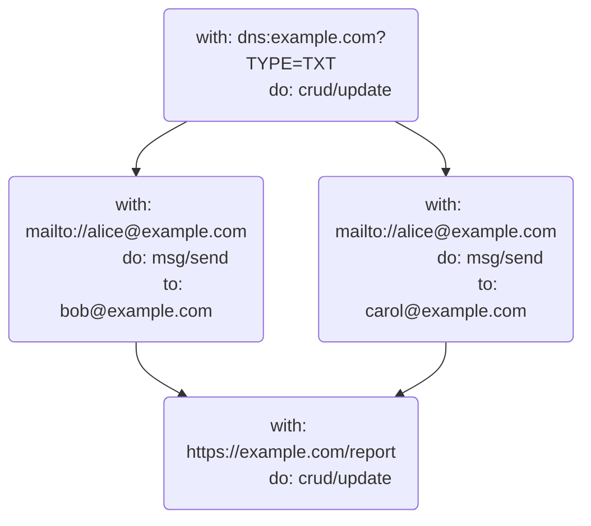
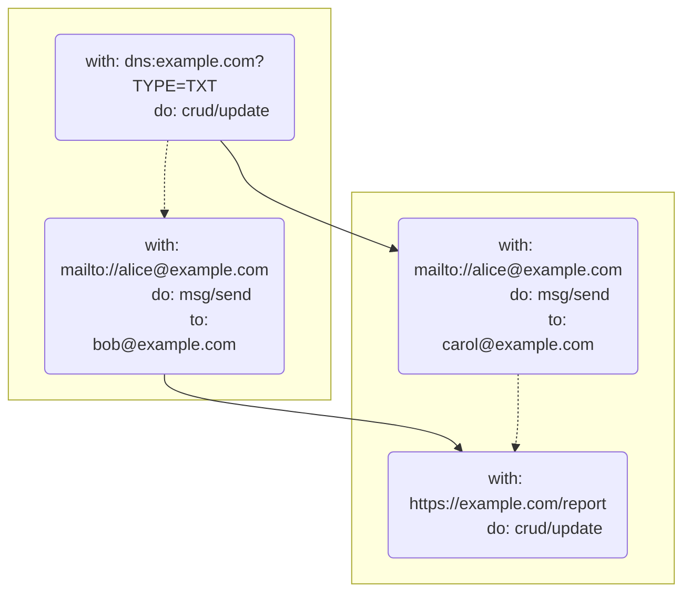

# UCAN Invocation Specification v0.1.1

## Editors

- [Brooklyn Zelenka](https://github.com/expede/), [Fission](https://fission.codes/)
- [Irakli Gozalishvili](https://github.com/Gozala), [DAG House](https://dag.house/)

## Authors

- [Brooklyn Zelenka](https://github.com/expede/), [Fission](https://fission.codes/)
- [Irakli Gozalishvili](https://github.com/Gozala), [DAG House](https://dag.house/)

## Depends On

- [DAG-CBOR]
- [UCAN]
- [UCAN-IPLD]
- [Varsig]

# 0 Abstract

UCAN Invocation defines a format for expressing the intention to execute delegated UCAN capabilities, the attested receipts from an execution, and how to extend computation via promise pipelining.

## Language

The key words "MUST", "MUST NOT", "REQUIRED", "SHALL", "SHALL NOT", "SHOULD", "SHOULD NOT", "RECOMMENDED", "MAY", and "OPTIONAL" in this document are to be interpreted as described in [RFC 2119](https://datatracker.ietf.org/doc/html/rfc2119).

# 1 Introduction

> Just because you can doesn't mean that you should
>
> — Anonymous

UCAN is a chained-capability format. A UCAN contains all of the information that one would need to perform some task, and the provable authority to do so. This begs the question: can UCAN be used directly as an RPC language?

Some teams have had success with UCAN directly for RPC when the intention is clear from context. This can be successful when there is more information on the channel than the UCAN itself (such as an HTTP path that a UCAN is sent to). However, capability invocation contains strictly more information than delegation: all of the authority of UCAN, plus the command to perform the task.

## 1.1 Intuition

## 1.1.1 Car Keys

Consider the following fictitious scenario:

Akiko is going away for the weekend. Her good friend Boris is going to borrow her car while she's away. They meet at a nearby cafe, and Akiko hands Boris her car keys. Boris now has the capability to drive Akiko's car whenever he wants to. Depending on their plans for the rest of the day, Akiko may find Boris quite rude if he immediately leaves the cafe to go for a drive. On the other hand, if Akiko asks Boris to run some last minute pre-vacation errands for that require a car, she may expect Boris to immediately drive off.

## 1.1.2 Lazy vs Eager Evaluation

In a referentially transparent setting, the description of a task is equivalent to having done so: a function and its results are interchangeable. [Programming languages with call-by-need semantics](https://en.wikipedia.org/wiki/Haskell) have shown that this can be an elegant programming model, especially for pure functions. However, _when_ something will run can sometimes be unclear.

Most languages use eager evaluation. Eager languages must contend directly with the distinction between a reference to a function and a command to run it. For instance, in JavaScript, adding parentheses to a function will run it. Omitting them lets the program pass around a reference to the function without immediately invoking it.

```js
const message = () => alert("hello world")
message // Nothing happens
message() // A message interrupts the user
```

Delegating a capability is like the statement `message`. Task is akin to `message()`. It's true that sometimes we know to run things from their surrounding context without the parentheses:

```js
[1, 2, 3].map(message) // Message runs 3 times
```

However, there is clearly a distinction between passing a function and invoking it. The same is true for capabilities: delegating the authority to do something is not the same as asking for it to be done immediately, even if sometimes it's clear from context.

## 1.2 Delegation Gossip

UCAN delegation can be gossiped freely between services. This is not true for invocation.

For example, if `alice@example.com` delegates her `web3.storage` storage quota to `bob@example.com`, it may be beneficial for all of the related `web3.storage` services to cache this information. If this were to be understood as an invocation, then gossiping this information would lead to validation failures due to principal misalignment in the certificate chain.

By distinguishing invocation from delegation, agents are able to understand the user intention, and handle such messages accordingly. Receipt of an invocation with misaligned principles will fail, but a delegation may be held in e.g. Bob's proxy inbox to be acted on when he comes online or widely distributed across the `web3.storage` infrastructure.

## 1.3 Separation of Concerns

Information about the scheduling, order, and pipelining of tasks is orthogonal to the flow of authority. An agent collaborating with the original executor does not need to know that their call is 3 invocations deep; they only need to know that they been asked to perform some task by the latest invoker.

As we shall see in the [discussion of promise pipelining][pipelines], asking an agent to perform a sequence of tasks before you know the exact parameters requires delegating capabilities for all possible steps in the pipeline. Pulling pipelining detail out of the core UCAN spec serves two functions: it keeps the UCAN spec focused on the flow of authority, and makes salient the level of de facto authority that the executor has (since they can claim any value as having returned for any step).

```txt
  ────────────────────────────────────────────Time──────────────────────────────────────────────────────►

┌──────────────────────────────────────────Delegation─────────────────────────────────────────────────────┐
│                                                                                                         │
│  ┌─────────┐   ┌─────────┐   ┌─────────┐         ┌─────────┐                ┌─────────┐                 │
│  │         │   │         │   │         │         │         │                │         │                 │
│  │  Alice  ├──►│   Bob   ├──►│  Carol  ├────────►│   Dan   ├───────────────►│  Erin   │                 │
│  │         │   │         │   │         │         │         │                │         │                 │
│  └─────────┘   └─────────┘   └─────────┘         └─────────┘                └─────────┘                 │
│                                                                                                         │
└─────────────────────────────────────────────────────────────────────────────────────────────────────────┘

┌──────────────────────────────────────────Invocation─────────────────────────────────────────────────────┐
│                                                                                                         │
│                              ┌─────────┐         ┌─────────┐                                            │
│                              │         │         │         │                                            │
│                              │  Carol  ╞═══All══►│   Dan   │                                            │
│                              │         │         │         │                                            │
│                              └─────────┘         └─────────┘                                            │
│                                                                                                         │
│                                                  ┌─────────┐                              ┌─────────┐   │
│                                                  │         │                              │         │   │
│                                                  │   Dan   ╞═══════════Update DB═════════►│  Erin   │   │
│                                                  │         │                              │         │   │
│                                                  └─────────┘                              └─────────┘   │
│                                                                                                         │
│                                                           ┌─────────┐                ┌─────────┐        │
│                                                           │         │                │         │        │
│                                                           │   Dan   ╞═══Read Email══►│  Erin   │        │
│                                                           │         │           ▲    │         │        │
│                                                           └─────────┘           ┆    └─────────┘        │
│                                                                               With                      │
│                                                                               Result                    │
│                                                                  ┌─────────┐   Of         ┌─────────┐   │
│                                                                  │         │    ┆         │         │   │
│                                                                  │   Dan   ╞════Set DNS══►│  Erin   │   │
│                                                                  │         │              │         │   │
│                                                                  └─────────┘              └─────────┘   │
│                                                                                                         │
└─────────────────────────────────────────────────────────────────────────────────────────────────────────┘
```

## 1.3 A Note On Serialization

The JSON examples below are given in [DAG-JSON], but UCAN Task is actually defined as IPLD. This makes UCAN Task agnostic to encoding. DAG-JSON follows particular conventions around wrapping CIDs and binary data in tags like so:

### CID

```json
{"/": "Qmf412jQZiuVUtdgnB36FXFX7xg5V6KEbSJ4dpQuhkLyfD"}
```

### Bytes

```json
{"/": {"bytes": "s0m3Byte5"}}
```

This format help disambiguate type information in generic [DAG-JSON] tooling. However, your presentation need not be in this specific format, as long as it can be converted to and from this cleanly. As it is used for the signature format, [DAG-CBOR] is RECOMMENDED.

## 1.4 Signatures

All payloads described in this spec MUST be signed with a [Varsig].

# 2 High-Level Concepts

## 2.1 Roles

Task adds two new roles to UCAN: invoker and executor. The existing UCAN delegator and delegate principals MUST persist to the invocation.

| UCAN Field | Delegation                             | Task                            |
| ---------- | -------------------------------------- | ------------------------------- |
| `iss`      | Delegator: transfer authority (active) | Invoker: request task (active)  |
| `aud`      | Delegate: gain authority (passive)     | Executor: perform task (active) |

### 2.1.1 Invoker

The invoker signals to the executor that a task associated with a UCAN SHOULD be performed.

The invoker MUST be the UCAN delegator. Their DID MUST be authenticated in the `iss` field of the contained UCAN.

### 2.1.2 Executor

The executor is directed to perform some task described in the UCAN by the invoker.

The executor MUST be the UCAN delegate. Their DID MUST be set the in `aud` field of the contained UCAN.

## 2.2 Components

### 2.2.1 Task

A [Task] is like a deferred function application: a request to perform some action on a resource with specific input.

### 2.2.2 Authorization

An [Authorization] is a cryptographically signed proof permitting execution of referenced [Task]s. It allows the [Invoker] to authorize a group of tasks using one cryptographic signature.

### 2.2.3 Invocation

An [Invocation] is a command to the [Executor] to run the [Task], authorized by the [Invoker].

### 2.2.4 Result

A [Result] is the output of a [Task].

### 2.2.5 Receipt

A [Receipt] is a cryptographically signed description of the [Invocation] output and requested [Effect]s.

### 2.2.6 Effect

An [Effect] are the instruction to the [Executor] to run set of [Task]s concurrently.

## 2.3 IPLD Schema

```ipldsch
type Task struct {
  on      URI
  call    Ability
  input   {String : Any}

  nnc     string
}

type URI string
type Ability string

type Authorization struct {
  # Authorization is denoted by the set of links been authorized
  scope   [&Any]
  # Scope signed by the invoker
  s       VarSig
}

type Invocation struct {
  v       SemVer

  run     &Task

  # Receipt of the invocation that caused this invocation
  cause   optional &Invocation

  # Task authorization.
  auth    &Authorization

  meta    {String : Any}

  prf     [&UCAN]
}

type SemVer string

type Receipt struct {
  # Invocation this is a receipt for
  ran     &Invocation

  # Output of the invocation
  out     Result

  # Effects to be performed
  fx      Effects
 
  # All the other metadata
  meta    {String : Any}

  # Principal that issued this receipt. If omitted issuer is
  # inferred from the invocation task audience.
  iss     optional Principal

  # When issuer is different from executor this MUST hold a UCAN
  # delegation chain from executor to the issuer. This should be 
  # omitted when the executor is the issuer.
  prf     [&UCAN]

  # Signature from the "iss".
  s       Varsig
}

type Result union {
  | any    "ok"    # Success
  | any    "error" # Error
} representation kinded

# Represents a request to invoke enclosed set of tasks concurrently
type Effects struct {
  # Primary set of tasks to be invoked
  fork      [&Task]
  
  # Continuation for straight-line programs
  join       optional &Task
}

# Way to reference result of the Task
type Await union {
  | &Task    "await/*"
  | &Task    "await/ok"
  | &Task    "await/error"
} representation keyed
```

# 3 Task

A Task is the smallest unit of work that can be requested from a UCAN. It describes one `(resource, ability, input)` triple. The `input` field is free form, and depend on the specific resource and ability being interacted with, and is not described in this specification.

Using the JavaScript analogy from the introduction, a Task is similar to wrapping a call in an anonymous function:

```json
{
  "on": "mailto:alice@example.com",
  "call": "msg/send",
  "input": {
    "to": [
      "bob@example.com",
      "carol@example.com"
    ],
    "subject": "hello",
    "body": "world"
  }
}
```

```js
// Pseudocode
() =>
  msg.send("mailto:alice@example.com", {
    to: ["bob@example.com", "carol@example.com"],
    subject: "hello",
    body: "world"
  })
```

Later, when we explore promise [pipelines], this also includes capturing the promise:

```json
{
  "bafy...getMailingList": {
    "on": "https://exmaple.com/mailinglist",
    "call": "crud/read"
  },
  "bafy...sendEmail": {
    "on": "mailto://alice@example.com",
    "call": "msg/send",
    "input": {
      "to": {
        "await/ok": {
          "/": "bafy...getMailingList"
        }
      },
      "subject": "hello",
      "body": "world"
    }
  }
}
```

```js
// Pseudocode
const mailingList = crud.read("https://exmaple.com/mailinglist");
const sendEmail = msg.send("mailto://alice@example.com", {
  to: mailingList.await().ok,
  subject: "hello",
  body: "world"
});
```

## 3.1 Schema

```ipldsch
type Task struct {
  on    URI
  call  Ability
  input {String : Any}
  nnc   string
}
```

## 3.2 Fields

### 3.2.1 Resource

The `on` field MUST contain the [URI](https://en.wikipedia.org/wiki/Uniform_Resource_Identifier) of the resource being accessed. If the resource being accessed is some static data, it is RECOMMENDED to reference it by the [`data`](https://en.wikipedia.org/wiki/Data_URI_scheme), [`ipfs`](https://docs.ipfs.tech/how-to/address-ipfs-on-web/#native-urls), or [`magnet`](https://en.wikipedia.org/wiki/Magnet_URI_scheme) URI schemes.

### 3.2.3 Ability

The `call` field MUST contain a [UCAN Ability](https://github.com/ucan-wg/spec/#23-ability). This field can be thought of as the message or trait being sent to the resource.

### 3.2.4 Input

The OPTIONAL `input` field, MAY contain any parameters expected by the URI/Ability pair, which MAY be different between different URIs and Abilities, and is thus left to the executor to define the shape of this data.

If present, `input` field MUST have an IPLD [map representation][ipld representation], and thus MAY be a:

1. [struct](https://ipld.io/docs/schemas/features/representation-strategies/#struct-map-representation) in map representation.
2. [keyed](https://ipld.io/docs/schemas/features/representation-strategies/#union-keyed-representation), [enveloped](https://ipld.io/docs/schemas/features/representation-strategies/#union-envelope-representation) or [inline](https://ipld.io/docs/schemas/features/representation-strategies/#union-inline-representation) union.
3. [unit](https://github.com/ipld/ipld/blob/353baf885adebb93191cbe1f7be34f0517e20bbd/specs/schemas/schema-schema.ipldsch#L753-L789) in empty map representation.
4. [map](https://ipld.io/docs/schemas/features/representation-strategies/#map-map-representation) in map representation.

UCAN capabilities provided in [Proofs] MAY impose certain constraint on the type of `input` allowed.

If `input` field is not present, it is implicitly a `unit` represented as empty map.

### 3.2.6 Nonce

If present, the OPTIONAL `nnc` field MUST include a random nonce expressed in ASCII. This field ensures that multiple invocations are unique.

## 3.3 DAG-JSON Examples

### 3.3.1 Interacting with an HTTP API

```json
{
  "on": "https://example.com/blog/posts",
  "call": "crud/create",
  "input": {
    "headers": {
      "content-type": "application/json"
    },
    "payload": {
      "title": "How UCAN Tasks Changed My Life",
      "body": "This is the story of how one spec changed everything...",
      "topics": [
        "authz",
        "journal"
      ],
      "draft": true
    }
  }
}
```

### 3.3.2 Sending Email

```json
{
  "on": "mailto:akiko@example.com",
  "call": "msg/send",
  "input": {
    "to": [
      "boris@example.com",
      "carol@example.com"
    ],
    "subject": "Coffee",
    "body": "Hey you two, I'd love to get coffee sometime and talk about UCAN Tasks!"
  }
}
```

### 3.3.3 Running WebAssembly

```json
{
  "on": "data:application/wasm;base64,AHdhc21lci11bml2ZXJzYWwAAAAAAOAEAAAAAAAAAAD9e7+p/QMAkSAEABH9e8GowANf1uz///8UAAAAAAAAAAAAAAAAAAAAAAAAAAAAAAAAAAAAAAAAAAAAAAAAAAAAAAAAAP////8AAAAACAAAACoAAAAIAAAABAAAACsAAAAMAAAACAAAANz///8AAAAA1P///wMAAAAlAAAALAAAAAAAAAAUAAAA/Xu/qf0DAJHzDx/44wMBqvMDAqphAkC5YAA/1mACALnzB0H4/XvBqMADX9bU////LAAAAAAAAAAAAAAAAAAAAAAAAAAvVXNlcnMvZXhwZWRlL0Rlc2t0b3AvdGVzdC53YXQAAGFkZF9vbmUHAAAAAAAAAAAAAAAAYWRkX29uZV9mAAAADAAAAAAAAAABAAAAAAAAAAkAAADk////AAAAAPz///8BAAAA9f///wEAAAAAAAAAAQAAAB4AAACM////pP///wAAAACc////AQAAAAAAAAAAAAAAnP///wAAAAAAAAAAlP7//wAAAACM/v//iP///wAAAAABAAAAiP///6D///8BAAAAqP///wEAAACk////AAAAAJz///8AAAAAlP///wAAAACM////AAAAAIT///8AAAAAAAAAAAAAAAAAAAAAAAAAAET+//8BAAAAWP7//wEAAABY/v//AQAAAID+//8BAAAAxP7//wEAAADU/v//AAAAAMz+//8AAAAAxP7//wAAAAAAAAAAAAAAAAAAAAAAAAAAAAAAAAAAAAAU////pP///wAAAAAAAQEBAQAAAAAAAACQ////AAAAAIj///8AAAAAAAAAAAAAAADQAQAAAAAAAA==",
  "call": "wasm/run",
  "input": {
    "func": "add_one",
    "args": [
      42
    ]
  }
}
```

# 4 Authorization

An [Authorization] is cryptographically signed data set. It represents an authorization to run [Task]s that are included in `scope` data set.

## 4.1 Schema

```ipldsch
type Authorization struct {
  # Authorization is denoted by the set of links been authorized
  scope   [&Any] (implicit [])

  # Scope signed by the invoker
  s       VarSig
}
```

### 4.2 Fields

#### 4.2.1 Authorization Scope

The `scope` field MUST be a set of links been authorized. It SHOULD be encoded as an alphabetically ordered list without duplicates.

If the `scope` field is omitted, it is implicitly treated as an empty list (authorizing nothing).

### 4.2.2 Signature

The `s` field MUST contain a [Varsig] of the [CBOR] encoded `scope` field.

## 4.3 DAG-JSON Example

```json
{
  "scope": [
    {
      "/": "bafyreihtmwju3okftpeuqe3x3ux5e7c2jescakwnoiyv45vnicke4kdxy4"
    },
    {
      "/": "bafyreieuo63r3y2nuycaq4b3q2xvco3nprlxiwzcfp4cuupgaywat3z6mq"
    }
  ],
  "s": {
    "/": {
      "bytes": "7aEDQIJB8XXJ6hWbwu40fN4bq8+Zq8BxyybSWXatMVU3VsL+yzVYpeJqsEBQE5rNtUJefR5rRCNimKNZMJjA9/udZQQ"
    }
  }
}
```

# 5 Invocation

As [noted in the introduction][lazy-vs-eager], there is a difference between a reference to a function and calling that function. The [Invocation] is an instruction to the [Executor] to perform enclosed [Task]. [Invocation]s are not executable until they have been provided provable authority (in form of UCANs in the `prf` field) and an [Authorization] (in the `auth` field) from the [Invoker].

The `auth` field MUST be contain an [Authorization] which signs over the `&Task` in `run`.

Concretely, this means that the `&Task` MUST be present in the associated `auth`'s `scope` field. An `Invocation` where the associated [Authorization] does not include the [Task] in the `scope` MUST be considered invalid.

## 5.1 Schema

```ipldsch
type Invocation struct {
  v       SemVer

  run     &Task
  # Receipt of the invocation that caused this invocation
  cause   optional &Invocation

  # Task authorization.
  auth    &Authorization

  meta    {String : any}

  prf     [&UCAN]
}

type SemVer string
```

## 5.2 Fields

### 5.2.1 UCAN Task Version

The `v` field MUST contain the SemVer-formatted version of the UCAN Invocation Specification that this struct conforms to.

### 5.2.2 Task

The `run` field MUST contain a link to the [Task] to be run.

### 5.2.3 Cause

[Task]s MAY be invoked as an effect caused by a prior [Invocation]. Such [Invocation]s SHOULD have a `cause` field set to the [Receipt] link of the [Invocation] that caused it. The linked [Receipt] MUST have an `Effect` (the `fx` field) containing invoked [Task] in the `run` field.

### 5.2.4 Authorization

The `auth` field MUST contain a link to the [Authorization] that authorizes invoked [Task] in the `run` field. The linked [Authorization] MUST contain `run` in its `scope`.

### 5.2.4 Proofs

The `prf` field MUST contain links to any UCANs that provide the authority to perform this task. All of the outermost proofs MUST have `aud` field set to the [Executor]'s DID. All of the outmost proofs MUST have `iss` field set to the [Invoker]'s DID.

### 5.2.6 Metadata

The OPTIONAL `meta` field MAY be used to include human-readable descriptions, tags, execution hints, resource limits, and so on. If present, the `meta` field MUST contain a map with string keys. The contents of the map are left undefined to encourage extensible use.

If `meta` field is not present, it is implicitly a `unit` represented as an empty map.

## 5.3 DAG-JSON Example

### 5.3.1 Single Invocation

```json
{
  "bafy...createBlogPost": {
    "on": "https://example.com/blog/posts",
    "call": "crud/create",
    "input": {
      "headers": {
        "content-type": "application/json"
      },
      "payload": {
        "title": "How UCAN Tasks Changed My Life",
        "body": "This is the story of how one spec changed everything...",
        "topics": [
          "authz",
          "journal"
        ],
        "draft": true
      }
    }
  },
  "bafy...auth": {
    "scope": [
      {
        "/": "bafy...createBlogPost"
      }
    ],
    "s": {
      "/": {
        "bytes": "7aEDQPPhXNvtVb5/T+O40xXU6TSgJZDFnlVaV3GMlaEo/dvxtyaCLm8uUsFK4xzQsQd82QQUYA6fK506XqjghRlucAQ"
      }
    }
  },
  "bafy...invocation": {
    "v": "0.1.0",
    "run": {
      "/": "bafy...createBlogPost"
    },
    "auth": {
      "/": "bafy...auth"
    },
    "prf": [
      {
        "/": "bafy...ucanProof"
      }
    ]
  }
}
```

### 5.3.1 Multiple Invocations

```json
{
  "bafy...createBlogPostTask": {
    "on": "https://example.com/blog/posts",
    "call": "crud/create",
    "input": {
      "headers": {
        "content-type": "application/json"
      },
      "payload": {
        "title": "How UCAN Tasks Changed My Life",
        "body": "This is the story of how one spec changed everything...",
        "topics": [
          "authz",
          "journal"
        ],
        "draft": true
      }
    }
  },
  "bafy...sendEmailTask": {
    "on": "mailto:akiko@example.com",
    "call": "msg/send",
    "input": {
      "to": [
        "boris@example.com",
        "carol@example.com"
      ],
      "body": "Hey you two, I'd love to get coffee sometime and talk about UCAN Tasks!",
      "subject": "Coffee"
    }
  },
  "bafy...multipleAuth": {
    "scope": [
      {
        "/": "bafy...sendEmailTask"
      },
      {
        "/": "bafy...createBlogPostTask"
      }
    ],
    "s": {
      "/": {
        "bytes": "7aEDQMyGqYw2iwP7uIn+Kav5AWe9l5VnL72Gpkzs1Azp+zs6vnixQPa1aCSrok4XwKkhSlFRmRN8YbyohB6iDFl4CQ8"
      }
    }
  },
  "bafy...createBlogPostInvocation": {
    "v": "0.1.0",
    "run": {
      "/": "bafy...createBlogPostTask"
    },
    "auth": {
      "/": "bafy...multipleAuth"
    },
    "prf": [
      {
        "/": "bafyreid6q7uslc33xqvodeysekliwzs26u5wglas3u4ndlzkelolbt5z3a"
      }
    ]
  },
  "bafy...sendEmailInvocation": {
    "v": "0.1.0",
    "run": {
      "/": "bafy...sendEmailTask"
    },
    "auth": {
      "/": "bafy...multipleAuth"
    },
    "prf": [
      {
        "/": "bafyreihvee5irbkfxspsim5s2zk2onb7hictmpbf5lne2nvq6xanmbm6e4"
      }
    ]
  }
}
```

### 5.3.3 Causal Invocations

```json
{
  "bafy...updateDnsTask": {
    "on": "dns:example.com?TYPE=TXT",
    "call": "crud/update",
    "input": {
      "value": "hello world"
    }
  },
  "bafy...auth": {
    "scope": [
      {
        "/": "bafyreievhy7rnzot7mnzbnqtiajhxx7fyn7y2wkjtuzwtmnflty3767dny"
      }
    ],
    "s": {
      "/": {
        "bytes": "7aEDQIscUKVuAIB2Yj6jdX5ru9OcnQLxLutvHPjeMD3pbtHIoErFpo7OoC79Oe2ShgQMLbo2e6dvHh9scqHKEOmieA0"
      }
    }
  },
  "bafy...updateDnsInvocation": {
    "v": "0.1.0",
    "run": {
      "/": "bafy...updateDnsTask"
    },
    "auth": {
      "/": "bafy...auth"
    },
    "cause": {
      "/": "bafy...somePriorInvocation"
    },
    "prf": [
      {
        "/": "bafyreieynwqrabzdhgl652ftsk4mlphcj3bxchkj2aw5eb6dc2wxieilau"
      }
    ]
  }
}
```

# 6 Result

A `Result` records the output of the [Task], as well as its success or failure state.

## 6.1 Schema

```ipldsch
type Result union {
  | any "ok"
  | any "error"
} representation keyed
```

## 6.2 Variants

## 6.2.1 Success

The success branch MUST contain the value returned from a successful [Task] wrapped in the `"ok"` tag. The exact shape of the returned data is left undefined to allow for flexibility in various Task types.

```json
{ "ok": 42 }
```

## 6.2.2 Failure

The failure branch MAY contain detail about why execution failed wrapped in the "error" tag. It is left undefined in this specification to allow for [Task] types to standardize the data that makes sense in their contexts.

If no information is available, this field SHOULD be set to `{}`.

```json
{
  "error": {
    "dev/reason": "unauthorized",
    "http/status": 401
  }
}
```

## 7 Effect

The result of an [Invocation] MAY include a request for further actions to be performed via "effects". This enables several things: a clean separation of pure return values from requesting impure tasks to be performed by the runtime, and gives the runtime the control to decide how (or if!) more work should be performed.

Effects describe requests for future work to be performed. All [Invocation]s in an [Effect] block MUST be treated as concurrent, unless explicit data dependencies between them exist via promise [Pipelines]. The `fx` block contains two fields: `fork` and `join`.

[Task]s listed in the `fork` field are first-class and only ordered by promises; they otherwise SHOULD be considered independent and equal. As such, atomic guarantees such as failure of one effect implying failure of other effects if left undefined.

The `join` field describes an OPTIONAL "special" [Invocation] which instruct the [Executor] that the [Task] [Invocation] is a continuation of the previous Invocation. This roughly emulates a virtual thread which terminates in an Invocation that produces Effect without a `join` field.

Tasks in the `fork` field MAY be related to the Task in the `join` field if there exists a Promise referencing either Task. If such a promise does not exist, then they SHOULD be treated as entirely separate and MAY be scheduled, deferred, fail, retry, and so on entirely separately.

## 7.1 Schema

```ipldsch
# Represents a request to invoke enclosed set of tasks concurrently
type Effect {
  # Primary set of tasks to be invoked
  fork      [&Invocation]
  
  # Additional task to be invoked with added semantics
  # of representing a workflow execution continuation.
  join       optional &Invocation
}
```

## 7.2 Fields

### 7.2.1 Forked Task Invocations

The OPTIONAL `fork` field, if present MUST be a list of an alphabetically ordered [Task] links. List MUST NOT not contain duplicate entries.

### 7.2.2 Joined Task Invocation

The OPTIONAL `join` field, if present MUST be set to a [Task] link.

## 7.3 DAG-JSON Examples

### 7.3.1 Effect spawning concurrent threads

```json
{
  "fork": [
    {
      "/": "bafyreigmmdzix2vxboojvv6j6h7sgvxnrecdxtglwtqpxw7hybebzlsax4"
    },
    {
      "/": "bafyreif6gfpzgxnii4ys6a4bjenefg737fb5bgam3onrbmhnoa4llk244q"
    }
  ]
}
```

### 7.3.2 Effect continuing thread execution

```json
{
  "join": {
    "/": "bafyreievhy7rnzot7mnzbnqtiajhxx7fyn7y2wkjtuzwtmnflty3767dny"
  }
}
```

### 7.3.1 Effect with fork & join

```json
{
  "join": {
    "/": "bafyreievhy7rnzot7mnzbnqtiajhxx7fyn7y2wkjtuzwtmnflty3767dny"
  },
  "fork": [
    {
      "/": "bafyreigmmdzix2vxboojvv6j6h7sgvxnrecdxtglwtqpxw7hybebzlsax4"
    },
    {
      "/": "bafyreif6gfpzgxnii4ys6a4bjenefg737fb5bgam3onrbmhnoa4llk244q"
    }
  ]
}
```

# 8 Receipt

A `Receipt` is an attestation of the [Result] and requested [Effect]s by a [Task] [Invocation]. A Receipt MUST be signed by the [Executor] or it's delegate. If signed by the delegate, the proof of delegation from the [Executor] to the delegate (the `iss` of the receipt) MUST be provided in `prf`.

**NB: a Receipt does not guarantee correctness of the result!** The statement's veracity MUST be only understood as an attestation from the executor.

Receipts MUST use the same version as the invocation that they contain.

## 8.1 Schema

```ipldsch
type Receipt struct {
  ran     &Invocation

  # output of the invocation
  out     Result

  # Effects to be performed
  fx      Effects

  # All the other metadata
  meta    {String: any}

  # Principal that issued this receipt. If omitted issuer is
  # inferred from the invocation task audience.
  iss     optional Principal

  # When issuer is different from executor this MUST hold a UCAN
  # delegation chain from executor to the issuer. Should be omitted executor is an issuer.
  prf     [&UCAN]

  # Signature from the `iss`.
  s       Varsig
}
```

## 8.2 Fields

### 8.2.1 Ran Invocation

The `ran` field MUST include a link to the [Invocation] that the Receipt is for.

### 8.2.2 Output

The `out` field MUST contain the value output of the invocation in [Result] format.

### 8.2.3 Effect

The OPTIONAL `fx` field, if present MUST be set to the caused [Effect]. The [Executor] SHOULD invoke contained [Task] to progress a workflow execution.

If `fx` does not contain OPTIONAL `join` field, it denotes completion of the current execution thread.

### 8.2.4 Metadata Fields

The OPTIONAL metadata field MAY be omitted or used to contain additional data about the receipt. This field MAY be used for tags, commentary, trace information, and so on.

### 8.2.5 Receipt Issuer

The OPTIONAL `iss` field, if present MUST contain the DID of the [Executor] delegate that signed it. If field is present, delegation from [Executor] MUST be included in the `prf` field.

If `iss` field is omitted, Receipt MUST be signed by the [Executor].

### 8.2.6 Proofs

If OPTIONAL `prf` field is present, MUST contain link to UCAN delegation authorizing Receipt Issuer (`iss`) to carry [Task] execution.

### 8.2.7 Signature

The `s` field MUST contain a [Varsig] of the [DAG-CBOR] encoded Receipt without `s` field. The signature MUST be generated by the [Executor] or a delegate if OPTIONAL `iss` field is set.

## 8.3 DAG-JSON Examples

### 8.3.1 Issued by Executor

```json
{
  "ran": {
    "/": "bafyreia5tctxekbm5bmuf6tsvragyvjdiiceg5q6wghfjiqczcuevmdqcu"
  },
  "out": {
    "ok": {
      "members": [
        "bob@example.com",
        "alice@web.mail"
      ]
    }
  },
  "meta": {
    "retries": 2,
    "time": [
      400,
      "hours"
    ]
  },
  "s": {
    "/": {
      "bytes": "7aEDQLYvb3lygk9yvAbk0OZD0q+iF9c3+wpZC4YlFThkiNShcVriobPFr/wl3akjM18VvIv/Zw2LtA4uUmB5m8PWEAU"
    }
  }
}
```

### 8.3.2 Issued by Delegate

```json
{
  "ran": {
    "/": "bafyreia5tctxekbm5bmuf6tsvragyvjdiiceg5q6wghfjiqczcuevmdqcu"
  },
  "out": {
    "ok": {
      "members": [
        "bob@example.com",
        "alice@web.mail"
      ]
    }
  },
  "meta": {
    "retries": 2,
    "time": [
      400,
      "hours"
    ]
  },
  "iss": "did:key:z6MkrZ1r5XBFZjBU34qyD8fueMbMRkKw17BZaq2ivKFjnz2z",
  "prf": [
    {
      "/": "bafyreihfgvlol74ugosa5gkzvbsghmq7wiqn4xvgack4uwn4qagrml6p74"
    }
  ],
  "s": {
    "/": {
      "bytes": "7aEDQKxIrga+88HNDd69Ho4Ggz8zkf+GxWC6dAGYua6l85YgiL3NqGxyGAygiSZtWrWUo6SokgOys2wYE7N+novtcwo"
    }
  }
}
```

### 7.3.3 Receipt with effects

```json
{
  "ran": {
    "/": "bafyreig3qnao4suz3lchh4joof7fhlobmgxhaal3vw4vtcghtlgtp7u4xy"
  },
  "out": {
    "ok": {
      "status": 200
    }
  },
  "fx": {
    "join": {
      "/": "bafyreievhy7rnzot7mnzbnqtiajhxx7fyn7y2wkjtuzwtmnflty3767dny"
    },
    "fork": [
      {
        "/": "bafyreigmmdzix2vxboojvv6j6h7sgvxnrecdxtglwtqpxw7hybebzlsax4"
      },
      {
        "/": "bafyreif6gfpzgxnii4ys6a4bjenefg737fb5bgam3onrbmhnoa4llk244q"
      }
    ]
  },
  "s": {
    "/": {
      "bytes": "7aEDQAHWabtCE+QikM3Np94TrA5T8n2yXqy8Uf35hgw0fe5c2Xi1O0h/JgrFmGl2Gsbhfm05zpdQmwfK2f/Sbe00YQE"
    }
  }
}
```

# 9 Pipelines

> Machines grow faster and memories grow larger. But the speed of light is constant and New York is not getting any closer to Tokyo. As hardware continues to improve, the latency barrier between distant machines will increasingly dominate the performance of distributed computation. When distributed computational steps require unnecessary round trips, compositions of these steps can cause unnecessary cascading sequences of round trips
>
> — [Mark Miller](https://github.com/erights), [Robust Composition](http://www.erights.org/talks/thesis/markm-thesis.pdf)

There MAY not be enough information to described an Invocation at creation time. However, all of the information required to construct the next request in a sequence MAY be available in the same Batch, or in a previous (but not yet complete) Invocation.

Some invocations MAY require input from set of other invocations. Waiting for each request to complete before proceeding to the next task has a performance impact due to the amount of latency. [Promise pipelining](http://erights.org/elib/distrib/pipeline.html) is a solution to this problem: by referencing a prior invocation, a pipelined invocation can direct the executor to use the output of one invocations into the input of the other. This liberates the invoker from waiting for each step.

An `Await` MAY be used as a variable placeholder for a concrete value in a [Task] [Invocation] output, waiting on a previous step to complete.

For example, consider the following invocation batch:

```json
{
  "bafyreiftw26kcrsf4tdijatgqxq6gtfhtrneetrcrp27ks6rvzsvzyanj4": {
    "on": "https://example.com/blog/posts",
    "call": "crud/create",
    "input": {
      "payload": {
        "title": "How UCAN Tasks Changed My Life",
        "body": "This is the story of how one spec changed everything..."
      }
    }
  },
  "bafyreifsvtyuiddvpsvurkwhyw3w55sp3nkw66gji6xxti5czol2q4hdqm": {
    "on": "https://example.com/users/editors",
    "call": "crud/read"
  },
  "bafyreiep7bzrz3irallgmsd43kipuh32khteq2dne4qc763txmvb2zmevu": {
    "on": "mailto:akiko@example.com",
    "call": "msg/send",
    "input": {
      "to": {
        "await/ok": {
          "/": "bafyreiftw26kcrsf4tdijatgqxq6gtfhtrneetrcrp27ks6rvzsvzyanj4"
        }
      },
      "subject": "Coffee",
      "body": {
        "await/ok": {
          "/": "bafyreifsvtyuiddvpsvurkwhyw3w55sp3nkw66gji6xxti5czol2q4hdqm"
        }
      }
    }
  },
  "bafyreiau3ygtmtv4jfkl4dgg6j6vhw5kwty5undybijexm35wmazgbb2tq": {
    "v": "0.1.0",
    "run": {
      "/": "bafyreiep7bzrz3irallgmsd43kipuh32khteq2dne4qc763txmvb2zmevu"
    },
    "auth": {
      "/": "bafyreibvtceb6flhmazpufpro6fneaqn7de7wxju74l2kuptwhxjyuecja"
    },
    "prf": [
      {
        "/": "bafyreihvee5irbkfxspsim5s2zk2onb7hictmpbf5lne2nvq6xanmbm6e4"
      }
    ]
  },
  "bafyreibvtceb6flhmazpufpro6fneaqn7de7wxju74l2kuptwhxjyuecja": {
    "scope": [
      {
        "/": "bafyreiftw26kcrsf4tdijatgqxq6gtfhtrneetrcrp27ks6rvzsvzyanj4"
      },
      {
        "/": "bafyreifsvtyuiddvpsvurkwhyw3w55sp3nkw66gji6xxti5czol2q4hdqm"
      },
      {
        "/": "bafyreiep7bzrz3irallgmsd43kipuh32khteq2dne4qc763txmvb2zmevu"
      }
    ],
    "s": {
      "/": {
        "bytes": "7aEDQDEGkezG7Bcpeknf2UJ7hpqeL1PZodrYYTSwRjqZPf67P4r1lRZvX+6+9gV+wDZUX0DZLMv64n2fPKnjvxrEugE"
      }
    }
  }
}
```

By analogy, above examples can be interpreted roughly as follows:

```js
const createDraft = crud.create("https://example.com/blog/posts", {
  payload: {
    title: "How UCAN Tasks Changed My Life",
    body: "This is the story of how one spec changed everything...",
  },
})

const getEditors = crud.read("https://example.com/users/editors")

const notify = msg.send("mailto:akiko@example.com", {
  to: (await createDraft).ok,
  subject: "Coffee",
  body: (await getEditors).ok,
})
```

Any [Task] field other besides `do` MAY be substituted with `Await`. The `do` field is critical in understanding what kind of action will be performed and CAN NOT be substituted with `Await`.

An [Await] MAY be used across [Invocation]s with a same [Authorization], or across [Invocation]s with different [Authorization] and MAY even be across multiple Invokers and Executors. As long as the invocation can be resolved, it MAY be promised. This is sometimes referred to as ["promise pipelining"](http://erights.org/elib/distrib/pipeline.html).

## Await

An `Await` describes the eventual output of the referenced [Task] invocation. An `Await` MUST resolve to an output [Result] with `await/*` variant. If unwrapping success or failure case is desired, corresponding `await/ok` or `await/error` variants MUST be used.

### 9.1 Schema

```ipldsch
type Await union {
  | &Task "await/*"
  | &Task "await/ok"
  | &Task "await/error"
} representation keyed
```

#### 9.2 Variants

##### 9.2.1 Success

The successful output of the [Task] MAY be referenced by wrapping the [Task] in the `"await/ok"` tag.

[Executor] MUST fail [Task] that `Await`s successful output of the failed [Task].

[Executor] MUST substitute [Task] field set to the [Await] of the successful [Task] with an (unwrapped) `ok` value of the output.

##### 9.2.2 Failure

The failed output of the [Task] MAY be referenced by wrapping the [Task] in the `"await/error"` tag.

[Executor] MUST fail [Task] that `Await`s failed output of the successful [Task].

[Executor] MUST substitute [Task] field set to the [Await] of the failed [Task] with an (unwrapped) `error` value of the output.

##### 9.2.3 Result

The [Result] output of the [Task] MAY be reference by wrapping the [Task] in the `"await/*"` tag.

[Executor] MUST substitute [Task] field set to the [Await] of the [Task] with a `Result` value of the output.

## 9.3 Dataflow

Pipelining uses [Await] as inputs to determine the required dataflow graph. The following examples both express the following dataflow graph:

### 9.3.1 Batched



```json
{
  "bafyreievhy7rnzot7mnzbnqtiajhxx7fyn7y2wkjtuzwtmnflty3767dny": {
    "on": "dns:example.com?TYPE=TXT",
    "call": "crud/update",
    "input": {
      "value": "hello world"
    }
  },
  "bafyreihbli7vcw2n42xqv43ushojh7nvto6zpb3rd5ekoo6mim6bfkkqku": {
    "on": "mailto://alice@example.com",
    "call": "msg/send",
    "input": {
      "to": "bob@example.com",
      "subject": "DNSLink for example.com",
      "body": {
        "await/ok": {
          "/": "bafyreievhy7rnzot7mnzbnqtiajhxx7fyn7y2wkjtuzwtmnflty3767dny"
        }
      }
    }
  },
  "bafyreifiwxa2mnjvbihr45q56j6vyy4ksml7fh2tq2wnqtf5n55yveevja": {
    "on": "mailto://alice@example.com",
    "call": "msg/send",
    "input": {
      "to": "carol@example.com",
      "subject": "Hey Carol, DNSLink was updated!",
      "body": {
        "await/ok": {
          "/": "bafyreievhy7rnzot7mnzbnqtiajhxx7fyn7y2wkjtuzwtmnflty3767dny"
        }
      }
    }
  },
  "bafyreiail3bkoyow46d6gnisj4dttiitifiaodee3ixynbhyq6vzxnvj2q": {
    "on": "https://example.com/report",
    "call": "crud/update",
    "input": {
      "payload": {
        "from": "mailto://alice@exmaple.com",
        "to": [
          "bob@exmaple.com",
          "carol@example.com"
        ],
        "event": "email-notification"
      },
      "_": [
        {
          "await/ok": {
            "/": "bafyreihbli7vcw2n42xqv43ushojh7nvto6zpb3rd5ekoo6mim6bfkkqku"
          }
        },
        {
          "await/ok": {
            "/": "bafyreifiwxa2mnjvbihr45q56j6vyy4ksml7fh2tq2wnqtf5n55yveevja"
          }
        }
      ]
    }
  },
  "bafyreid2esrl52jp5rx6kh7opwlc2jnzhci7yd5jtlzwlqytujk6y6urza": {
    "v": "0.1.0",
    "run": {
      "/": "bafyreiail3bkoyow46d6gnisj4dttiitifiaodee3ixynbhyq6vzxnvj2q"
    },
    "auth": {
      "/": "bafyreigjddazpbxmomcl32ryjxaxqymdrvzpqzjq5xtctdncn65kszmsoi"
    },
    "prf": [
      {
        "/": "bafyreiflsrhtwctat4gulwg5g55evudlrnsqa2etnorzrn2tsl2kv2in5i"
      }
    ]
  },
  "bafyreigjddazpbxmomcl32ryjxaxqymdrvzpqzjq5xtctdncn65kszmsoi": {
    "scope": [
      {
        "/": "bafyreihbli7vcw2n42xqv43ushojh7nvto6zpb3rd5ekoo6mim6bfkkqku"
      },
      {
        "/": "bafyreifiwxa2mnjvbihr45q56j6vyy4ksml7fh2tq2wnqtf5n55yveevja"
      },
      {
        "/": "bafyreievhy7rnzot7mnzbnqtiajhxx7fyn7y2wkjtuzwtmnflty3767dny"
      },
      {
        "/": "bafyreiail3bkoyow46d6gnisj4dttiitifiaodee3ixynbhyq6vzxnvj2q"
      }
    ],
    "s": {
      "/": {
        "bytes": "7aEDQLbVVvN/RU8juyz+r36xMgCP1Eh1OknVckuCPrkTmvGS+ULTtCcvjF3gCqpqf6As7VLewoqTvWX1sswRudmOvAY"
      }
    }
  }
}
```

### 9.4.2 Serial



```json
{
  "bafyreievhy7rnzot7mnzbnqtiajhxx7fyn7y2wkjtuzwtmnflty3767dny": {
    "on": "dns:example.com?TYPE=TXT",
    "call": "crud/update",
    "input": {
      "value": "hello world"
    }
  },
  "bafyreihbli7vcw2n42xqv43ushojh7nvto6zpb3rd5ekoo6mim6bfkkqku": {
    "on": "mailto://alice@example.com",
    "call": "msg/send",
    "input": {
      "to": "bob@example.com",
      "subject": "DNSLink for example.com",
      "body": {
        "await/ok": {
          "/": "bafyreievhy7rnzot7mnzbnqtiajhxx7fyn7y2wkjtuzwtmnflty3767dny"
        }
      }
    }
  },
  "bafyreieeq5rf6uolaitbam2v56xmoz466eri3xcfwfawphon644cbgbkra": {
    "v": "0.1.0",
    "run": {
      "/": "bafyreihbli7vcw2n42xqv43ushojh7nvto6zpb3rd5ekoo6mim6bfkkqku"
    },
    "auth": {
      "/": "bafyreif343mg6uhtqa7qbuvd3glu3vjaya5q757dqyobwt5wysbh4h5rnq"
    },
    "prf": [
      {
        "/": "bafyreibblnq5bawcchzh73nxkdmkx47hu64uwistvg4kyvdgfd6igkcnha"
      }
    ]
  },
  "bafyreif343mg6uhtqa7qbuvd3glu3vjaya5q757dqyobwt5wysbh4h5rnq": {
    "scope": [
      {
        "/": "bafyreihbli7vcw2n42xqv43ushojh7nvto6zpb3rd5ekoo6mim6bfkkqku"
      },
      {
        "/": "bafyreievhy7rnzot7mnzbnqtiajhxx7fyn7y2wkjtuzwtmnflty3767dny"
      }
    ],
    "s": {
      "/": {
        "bytes": "7aEDQG2GvLnr2gVEfMDrEUV8S3fw8JuFGVKAGIhSZCqCmHGyQ8cdU2A/Vp97yAsZQ+tqBaMWN3Q6YJLfPpAdgaXf2gY"
      }
    }
  }
}
```

```json
{
  "bafyreifiwxa2mnjvbihr45q56j6vyy4ksml7fh2tq2wnqtf5n55yveevja": {
    "on": "mailto://alice@example.com",
    "call": "msg/send",
    "input": {
      "to": "carol@example.com",
      "subject": "Hey Carol, DNSLink was updated!",
      "body": {
        "await/ok": {
          "/": "bafyreievhy7rnzot7mnzbnqtiajhxx7fyn7y2wkjtuzwtmnflty3767dny"
        }
      }
    }
  },
  "bafyreiail3bkoyow46d6gnisj4dttiitifiaodee3ixynbhyq6vzxnvj2q": {
    "on": "https://example.com/report",
    "call": "crud/update",
    "input": {
      "payload": {
        "from": "mailto://alice@exmaple.com",
        "to": [
          "bob@exmaple.com",
          "carol@example.com"
        ],
        "event": "email-notification"
      },
      "_": [
        {
          "await/ok": {
            "/": "bafyreihbli7vcw2n42xqv43ushojh7nvto6zpb3rd5ekoo6mim6bfkkqku"
          }
        },
        {
          "await/ok": {
            "/": "bafyreifiwxa2mnjvbihr45q56j6vyy4ksml7fh2tq2wnqtf5n55yveevja"
          }
        }
      ]
    }
  },
  "bafyreih6wl2uvxuvpeicddv7exg5nixvc7kydbj3wlq24z37q5rd6vo5ky": {
    "v": "0.1.0",
    "run": {
      "/": "bafyreiail3bkoyow46d6gnisj4dttiitifiaodee3ixynbhyq6vzxnvj2q"
    },
    "auth": {
      "/": "bafyreiersek7u2lvzyolszwm5j5iy74qshc4oekszao7dmbwnnx4623du4"
    },
    "prf": [
      {
        "/": "bafyreiflsrhtwctat4gulwg5g55evudlrnsqa2etnorzrn2tsl2kv2in5i"
      }
    ]
  },
  "bafyreiersek7u2lvzyolszwm5j5iy74qshc4oekszao7dmbwnnx4623du4": {
    "scope": [
      {
        "/": "bafyreifiwxa2mnjvbihr45q56j6vyy4ksml7fh2tq2wnqtf5n55yveevja"
      },
      {
        "/": "bafyreiail3bkoyow46d6gnisj4dttiitifiaodee3ixynbhyq6vzxnvj2q"
      }
    ],
    "s": {
      "/": {
        "bytes": "7aEDQM1yNTEO/+TF69wUwteH+ftAjD0ik5tXDa+sheAiuOZobSco/+vU882/Nf3LtMRF1EDoP/H38PX2bD5nJzkHAAU"
      }
    }
  }
}
```

# 10 Prior Art

[ucanto RPC](https://github.com/web3-storage/ucanto) from DAG House is a production system that uses UCAN as the basis for an RPC layer.

The [Capability Transport Protocol (CapTP)](http://erights.org/elib/distrib/captp/index.html) is one of the most influential object-capability systems, and forms the basis for much of the rest of the items on this list.

The [Object Capability Network (OCapN)](https://github.com/ocapn/ocapn) protocol extends CapTP with a generalized networking layer. It has implementations from the [Spritely Institute](https://www.spritely.institute/) and [Agoric](https://agoric.com/). At time of writing, it is in the process of being standardized.

[Electronic Rights Transfer Protocol (ERTP)](https://docs.agoric.com/guides/ertp/) builds on top of CapTP for blockchain & digital asset use cases.

[Cap 'n Proto RPC](https://capnproto.org/) is an influential RPC framework [based on concepts from CapTP](https://capnproto.org/rpc.html#specification).

# 11 Acknowledgements

Many thanks to [Mark Miller](https://github.com/erights) for his [pioneering work](http://erights.org/talks/thesis/markm-thesis.pdf) on [capability systems](http://erights.org/).

Many thanks to [Luke Marsen](https://github.com/lukemarsden) and [Simon Worthington](https://github.com/simonwo) for their feedback on invocation model from their work on [Bacalhau](https://www.bacalhau.org/) and [IPVM](https://github.com/ipvm-wg).

Many thanks to [Zeeshan Lakhani](https://github.com/zeeshanlakhani) for his many suggestions, references, clarifications, and suggestions on how to restructure sections for clarity.

Thanks to [Marc-Antoine Parent](https://github.com/maparent) for his discussions of the distinction between declarations and directives both in and out of a UCAN context.

Many thanks to [Quinn Wilton](https://github.com/QuinnWilton) for her discussion of speech acts, the dangers of signing canonicalized data, and ergonomics.

Thanks to [Blaine Cook](https://github.com/blaine) for sharing their experiences with OAuth 1, irreversible design decisions, and advocating for keeping the spec simple-but-evolvable.

Thanks to [Philipp Krüger](https://github.com/matheus23/) for the enthusiastic feedback on the overall design and encoding.

Thanks to [Christine Lemmer-Webber](https://github.com/cwebber) for the many conversations about capability systems and the programming models that they enable.

Thanks to [Rod Vagg](https://github.com/rvagg/) for the clarifications on IPLD Schema implicits and the general IPLD worldview.

[dag-json]: https://ipld.io/docs/codecs/known/dag-json/
[varsig]: https://github.com/ChainAgnostic/varsig/
[ucan-ipld]: https://github.com/ucan-wg/ucan-ipld/
[ucan]: https://github.com/ucan-wg/spec/
[dag-cbor]: https://ipld.io/specs/codecs/dag-cbor/spec/
[ipld representation]: https://ipld.io/docs/schemas/features/representation-strategies/
[lazy-vs-eager]: #112-lazy-vs-eager-evaluation
[invoker]: #211-invoker
[executor]: #212-executor
[task]: #3-task
[authorization]: #4-authorization
[invocation]: #5-invocation
[result]: #6-result
[effect]: #7-effect
[receipt]: #8-receipt
[pipelines]: #9-pipelines
[await]: #await
