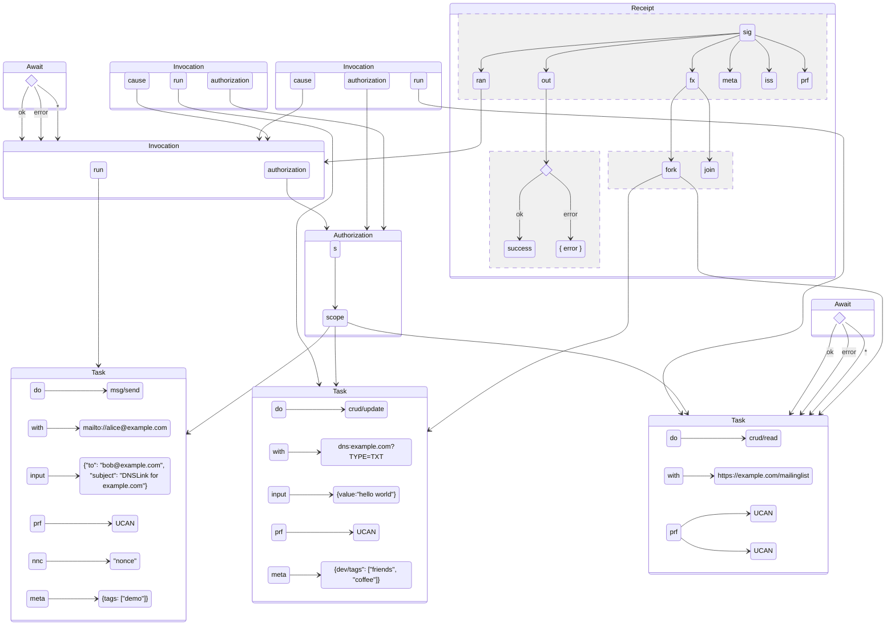
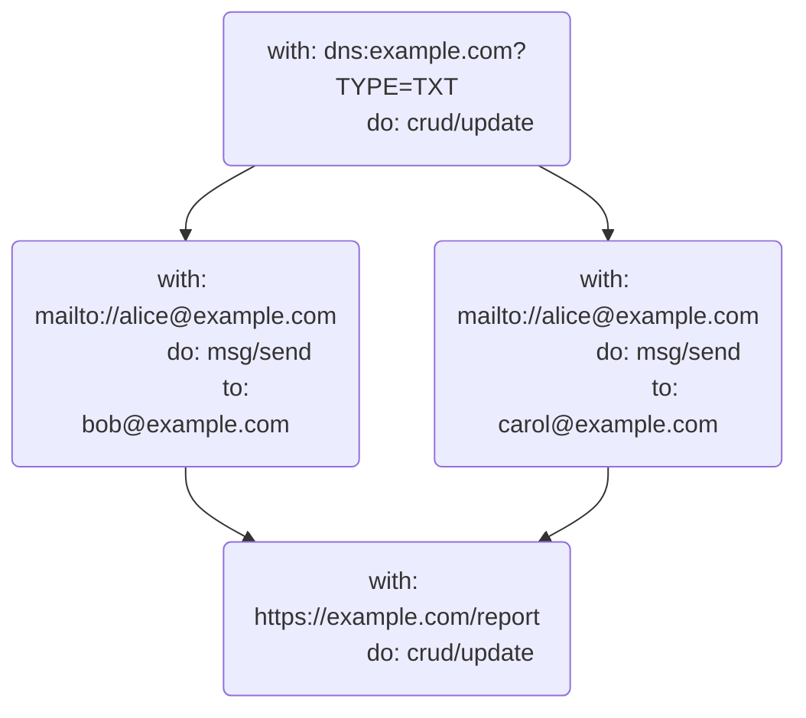
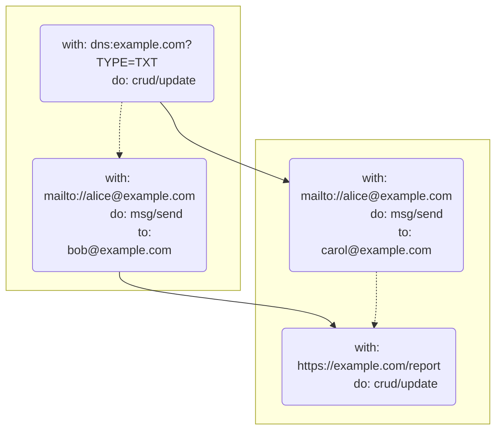

# UCAN Invocation Specification v0.1.0

## Editors

- [Brooklyn Zelenka](https://github.com/expede/), [Fission](https://fission.codes/)
- [Irakli Gozalishvili](https://github.com/Gozala), [DAG House](https://dag.house/)

## Authors

- [Brooklyn Zelenka](https://github.com/expede/), [Fission](https://fission.codes/)
- [Irakli Gozalishvili](https://github.com/Gozala), [DAG House](https://dag.house/)

## Depends On

- [DAG-CBOR]
- [UCAN]
- [UCAN-IPLD]
- [Varsig]

# 0 Abstract

UCAN Invocation defines a format for expressing the intention to execute delegated UCAN capabilities, the attested receipts from an execution, and how to extend computation via promise pipelining.

## Language

The key words "MUST", "MUST NOT", "REQUIRED", "SHALL", "SHALL NOT", "SHOULD", "SHOULD NOT", "RECOMMENDED", "MAY", and "OPTIONAL" in this document are to be interpreted as described in [RFC 2119](https://datatracker.ietf.org/doc/html/rfc2119).

# 1 Introduction

> Just because you can doesn't mean that you should
>
> — Anonymous

UCAN is a chained-capability format. A UCAN contains all of the information that one would need to perform some task, and the provable authority to do so. This begs the question: can UCAN be used directly as an RPC language?

Some teams have had success with UCAN directly for RPC when the intention is clear from context. This can be successful when there is more information on the channel than the UCAN itself (such as an HTTP path that a UCAN is sent to). However, capability invocation contains strictly more information than delegation: all of the authority of UCAN, plus the command to perform the task.

## 1.1 Intuition

## 1.1.1 Car Keys

Consider the following fictitious scenario:

Akiko is going away for the weekend. Her good friend Boris is going to borrow her car while she's away. They meet at a nearby cafe, and Akiko hands Boris her car keys. Boris now has the capability to drive Akiko's car whenever he wants to. Depending on their plans for the rest of the day, Akiko may find Boris quite rude if he immediately leaves the cafe to go for a drive. On the other hand, if Akiko asks Boris to run some last minute pre-vacation errands for that require a car, she may expect Boris to immediately drive off.

## 1.1.2 Lazy vs Eager Evaluation

In a referentially transparent setting, the description of a task is equivalent to having done so: a function and its results are interchangeable. [Programming languages with call-by-need semantics](https://en.wikipedia.org/wiki/Haskell) have shown that this can be an elegant programming model, especially for pure functions. However, _when_ something will run can sometimes be unclear.

Most languages use eager evaluation. Eager languages must contend directly with the distinction between a reference to a function and a command to run it. For instance, in JavaScript, adding parentheses to a function will run it. Omitting them lets the program pass around a reference to the function without immediately invoking it.

```js
const message = () => alert("hello world")
message // Nothing happens
message() // A message interrupts the user
```

Delegating a capability is like the statement `message`. Task is akin to `message()`. It's true that sometimes we know to run things from their surrounding context without the parentheses:

```js
;[1, 2, 3].map(message) // Message runs 3 times
```

However, there is clearly a distinction between passing a function and invoking it. The same is true for capabilities: delegating the authority to do something is not the same as asking for it to be done immediately, even if sometimes it's clear from context.

## 1.2 Gossiping of delegations

In web3.storage user `alice@web.mail` can delegate to store file in her space to `bob@send.io` by sending that delegation to `web3.storage`. If service were to interpret this as invocation it would fail due to principal misalignment. By distinguishing capability invocation from delegation service is able to more correctly handle such a message, if it is an invocation it will still error due to principal misalignment, if it is a delegation it will hold it in Bob's inbox to be picked up when he's comes online.

## 1.3 Separation of Concerns

Information about the scheduling, order, and pipelining of tasks is orthogonal to the flow of authority. An agent collaborating with the original executor does not need to know that their call is 3 invocations deep; they only need to know that they been asked to perform some task by the latest invoker.

As we shall see in the [discussion of promise pipelining][pipelines], asking an agent to perform a sequence of tasks before you know the exact parameters requires delegating capabilities for all possible steps in the pipeline. Pulling pipelining detail out of the core UCAN spec serves two functions: it keeps the UCAN spec focused on the flow of authority, and makes salient the level of de facto authority that the executor has (since they can claim any value as having returned for any step).

```txt
  ────────────────────────────────────────────Time──────────────────────────────────────────────────────►

┌──────────────────────────────────────────Delegation─────────────────────────────────────────────────────┐
│                                                                                                         │
│  ┌─────────┐   ┌─────────┐   ┌─────────┐         ┌─────────┐                ┌─────────┐                 │
│  │         │   │         │   │         │         │         │                │         │                 │
│  │  Alice  ├──►│   Bob   ├──►│  Carol  ├────────►│   Dan   ├───────────────►│  Erin   │                 │
│  │         │   │         │   │         │         │         │                │         │                 │
│  └─────────┘   └─────────┘   └─────────┘         └─────────┘                └─────────┘                 │
│                                                                                                         │
└─────────────────────────────────────────────────────────────────────────────────────────────────────────┘

┌──────────────────────────────────────────Invocation─────────────────────────────────────────────────────┐
│                                                                                                         │
│                              ┌─────────┐         ┌─────────┐                                            │
│                              │         │         │         │                                            │
│                              │  Carol  ╞═══All══►│   Dan   │                                            │
│                              │         │         │         │                                            │
│                              └─────────┘         └─────────┘                                            │
│                                                                                                         │
│                                                  ┌─────────┐                              ┌─────────┐   │
│                                                  │         │                              │         │   │
│                                                  │   Dan   ╞═══════════Update DB═════════►│  Erin   │   │
│                                                  │         │                              │         │   │
│                                                  └─────────┘                              └─────────┘   │
│                                                                                                         │
│                                                           ┌─────────┐                ┌─────────┐        │
│                                                           │         │                │         │        │
│                                                           │   Dan   ╞═══Read Email══►│  Erin   │        │
│                                                           │         │           ▲    │         │        │
│                                                           └─────────┘           ┆    └─────────┘        │
│                                                                               With                      │
│                                                                               Result                    │
│                                                                  ┌─────────┐   Of         ┌─────────┐   │
│                                                                  │         │    ┆         │         │   │
│                                                                  │   Dan   ╞════Set DNS══►│  Erin   │   │
│                                                                  │         │              │         │   │
│                                                                  └─────────┘              └─────────┘   │
│                                                                                                         │
└─────────────────────────────────────────────────────────────────────────────────────────────────────────┘
```

## 1.3 A Note On Serialization

The JSON examples below are given in [DAG-JSON], but UCAN Task is actually defined as IPLD. This makes UCAN Task agnostic to encoding. DAG-JSON follows particular conventions around wrapping CIDs and binary data in tags like so:

### CID

```json
{"/": "Qmf412jQZiuVUtdgnB36FXFX7xg5V6KEbSJ4dpQuhkLyfD"}

### Bytes

```json
{"/": {"bytes": "s0m3Byte5"}}
```

This format help disambiguate type information in generic [DAG-JSON] tooling. However, your presentation need not be in this specific format, as long as it can be converted to and from this cleanly. As it is used for the signature format, [DAG-CBOR] is RECOMMENDED.

## 1.4 Signatures

All payloads described in this spec MUST be signed with a [Varsig].

# 2 High-Level Concepts

## 2.1 Roles

Task adds two new roles to UCAN: invoker and executor. The existing UCAN delegator and delegate principals MUST persist to the invocation.

| UCAN Field | Delegation                             | Task                            |
| ---------- | -------------------------------------- | ------------------------------- |
| `iss`      | Delegator: transfer authority (active) | Invoker: request task (active)  |
| `aud`      | Delegate: gain authority (passive)     | Executor: perform task (active) |

### 2.1.1 Invoker

The invoker signals to the executor that a task associated with a UCAN SHOULD be performed.

The invoker MUST be the UCAN delegator. Their DID MUST be authenticated in the `iss` field of the contained UCAN.

### 2.1.2 Executor

The executor is directed to perform some task described in the UCAN by the invoker.

The executor MUST be the UCAN delegate. Their DID MUST be set the in `aud` field of the contained UCAN.

## 2.2 Components



### 2.2.1 Task

A [Task] is like a deferred function application: a request to perform some action on a resource with specific input.

### 2.2.2 Authorization

An [Authorization] is a cryptographically signed proof permitting execution of referenced tasks. It allows invoker to authorize a group of tasks using one cryptographic signature.

### 2.2.3 Invocation

An [Invocation] is an invoker authorized instruction to the [Executor] to run the [Task].

### 2.2.4 Result

A [Result] is the output of a [Task].

### 2.2.5 Receipt

A [Receipt] is a cryptographically signed description of the [Invocation] output.

### 2.2.6 Effect

An [Effect] are the instruction to the [Executor] to run set of [Task]s concurrently.

## 2.3 IPLD Schema

```ipldsch
type Task struct {
  with    URI
  do      Ability
  input   {String: any} (implicit "{}")

  nnc     string (implicit "''")
}

type URI string
type Ability string

type Authorization struct {
  # Authorization is denoted by the set of links been authorized
  scope   [&Any] (implicit "[]")
  # Scope signed by the invoker
  s       VarSig
}

type Invocation struct {
  v       SemVer

  run     &Task
  # Receipt of the invocation that caused this invocation
  cause   optional &Invocation
  # Task authorization.
  auth    &Authorization

  meta    {String : any} (implicit "{}")

  prf     [&UCAN] (implicit "[]")
}
type SemVer string

type Receipt struct {
  # Invocation this is a receipt for
  ran     &Invocation

  # Output of the invocation
  out     Result

  # Effects to be performed
  fx      Effect        (implicit "{}")

  # All the other metadata
  meta    {String: any} (implicit "{}")

  # Principal that issued this receipt. If omitted issuer is
  # inferred from the invocation task audience.
  iss     optional Principal

  # When issuer is different from executor this MUST hold a UCAN
  # delegation chain from executor to the issuer. Should be omitted executor is an issuer.
  prf     [&UCAN]       (implicit "[]")

  # Signature from the "iss".
  s       Varsig
}

type Result union {
  | any    "ok"    # Success
  | any    "error" # Error
} representation kinded

# Represents a request to invoke enclosed set of tasks concurrently
type Effect struct {
  # Primary set of tasks to be invoked
  fork      [&Invocation]     (implicit "[]")
  
  # Additional task to be invoked with added semantics
  # of representing a workflow execution continuation.
  join       optional &Promise
}

# Promise is an Invocation with optional 'auth' field which if omitted
# is implicitly an 'auth' of the Invocation that contains Await.
type Promise struct {
  v       SemVer

  run     &Task
  # Receipt of the invocation that caused this invocation
  cause   optional &Invocation
  # Task authorization. If omitted can be interpreted as requires
  # authorization 
  auth    optional &Authorization

  meta    {String : any} (implicit "{}")

  prf     [&UCAN] (implicit "[]")
}

# Promise is a way to reference result of the invocation
type Await union {
  | &Promise    "await/*"
  | &Promise    "await/ok"
  | &Promise    "await/error"
} representation keyed
```

# 3 Task

A Task is the smallest unit of work that can be requested from a UCAN. It describes one `(resource, ability, input)` triple. The `input` field is free form, and depend on the specific resource and ability being interacted with, and is not described in this specification.

Using the JavaScript analogy from the introduction, a Task is similar to wrapping a call in an anonymous function:

```json
{
  "do": "msg/send",
  "with": "mailto:alice@example.com",
  "input": {
    "to": [
      "bob@example.com",
      "carol@example.com"
    ],
    "subject": "hello",
    "body": "world"
  }
}
```

```js
// Pseudocode
() =>
  msg.send("mailto:alice@example.com", {
    to: ["bob@example.com", "carol@example.com"],
    subject: "hello",
    body: "world"
  })
```

Later, when we explore promise [pipelines], this also includes capturing the promise:

```json
{
  "bafyreid32aunjg6g6buib7bva2sa5ni4c6eaftgykyh6z6rnhcjxh4yk2y": {
    "do": "crud/read",
    "with": "https://exmaple.com/mailinglist"
  },
  "bafyreigfusg7tgegda7pxdn7px5vs7wxqk5nybr5ewjht4xas357x6ryia": {
    "do": "msg/send",
    "with": "mailto://alice@example.com",
    "input": {
      "to": {
        "await/ok": {
          "/": "bafyreifkeu34pzda27fozfcboh25psekhqehkvnekltoiaspb5jsp6pj5q"
        }
      },
      "subject": "hello",
      "body": "world"
    }
  }
}
```

```js
// Pseudocode
const mailingList = crud.read("https://exmaple.com/mailinglist");
const sendEmail = msg.send("mailto://alice@example.com", {
  to: mailingList.await().ok,
  subject: "hello",
  body: "world"
});
```

## 3.1 Schema

```ipldsch
type Task struct {
  v       SemVer
  with    URI
  do      Ability
  input   {String:any}    (implicit "{}")
  meta    {String:any}    (implicit "{}")
  nnc     string          (implicit "''")
  prf     [&UCAN]         (implicit "[]")
}

type URI string
type SemVer string

```

## 3.2 Fields

### 3.2.1 UCAN Task Version

The `v` field MUST contain the SemVer-formatted version of the UCAN Task Specification that this struct conforms to.

### 3.2.2 Resource

The `with` field MUST contain the [URI](https://en.wikipedia.org/wiki/Uniform_Resource_Identifier) of the resource being accessed. If the resource being accessed is some static data, it is RECOMMENDED to reference it by the [`data`](https://en.wikipedia.org/wiki/Data_URI_scheme), [`ipfs`](https://docs.ipfs.tech/how-to/address-ipfs-on-web/#native-urls), or [`magnet`](https://en.wikipedia.org/wiki/Magnet_URI_scheme) URI schemes.

### 3.2.3 Ability

The `do` field MUST contain a [UCAN Ability](https://github.com/ucan-wg/spec/#23-ability). This field can be thought of as the message or trait being sent to the resource.

### 3.2.4 Input

The OPTIONAL `input` field, MAY contain any parameters expected by the URI/Ability pair, which MAY be different between different URIs and Abilities, and is thus left to the executor to define the shape of this data.

If present, `input` field MUST have an IPLD [map representation][ipld representation], and thus MAY be a:

1. [struct](https://ipld.io/docs/schemas/features/representation-strategies/#struct-map-representation) in map representation.
2. [keyed](https://ipld.io/docs/schemas/features/representation-strategies/#union-keyed-representation), [enveloped](https://ipld.io/docs/schemas/features/representation-strategies/#union-envelope-representation) or [inline](https://ipld.io/docs/schemas/features/representation-strategies/#union-inline-representation) union.
3. [unit](https://github.com/ipld/ipld/blob/353baf885adebb93191cbe1f7be34f0517e20bbd/specs/schemas/schema-schema.ipldsch#L753-L789) in empty map representation.
4. [map](https://ipld.io/docs/schemas/features/representation-strategies/#map-map-representation) in map representation.

UCAN capabilities provided in [Proofs] MAY impose certain constraint on the type of `input` allowed.

If `input` field is not present, it is implicitly a `unit` represented as empty map.

### 3.2.5 Metadata

The OPTIONAL `meta` field MAY be used to include human-readable descriptions, tags, execution hints, resource limits, and so on. If present, the `meta` field MUST contain a map with string keys. The contents of the map are left undefined to encourage extensible use.

If `meta` field is not present, it is implicitly a `unit` represented as an empty map.

### 3.2.6 Nonce

If present, the OPTIONAL `nnc` field MUST include a random nonce expressed in ASCII. This field ensures that multiple invocations are unique.

### 3.2.7 Proofs

The `prf` field MUST contain links to any UCANs that provide the authority to perform this task. All of the outermost proofs MUST have `aud` field set to the [Executor]'s DID. All of the outmost proofs MUST have `iss` field set to the [Invoker]'s DID.

## 3.3 DAG-JSON Examples

### 3.3.1 Interacting with an HTTP API

```json
{
  "do": "crud/create",
  "with": "https://example.com/blog/posts",
  "input": {
    "headers": {
      "content-type": "application/json"
    },
    "payload": {
      "title": "How UCAN Tasks Changed My Life",
      "body": "This is the story of how one spec changed everything...",
      "topics": [
        "authz",
        "journal"
      ],
      "draft": true
    }
  }
}
```

### 3.3.2 Sending Email

```json
{
  "do": "msg/send",
  "with": "mailto:akiko@example.com",
  "input": {
    "to": [
      "boris@example.com",
      "carol@example.com"
    ],
    "subject": "Coffee",
    "body": "Hey you two, I'd love to get coffee sometime and talk about UCAN Tasks!"
  }
}
```

### 3.3.3 Running WebAssembly

```json
{
  "do": "wasm/run",
  "with": "data:application/wasm;base64,AHdhc21lci11bml2ZXJzYWwAAAAAAOAEAAAAAAAAAAD9e7+p/QMAkSAEABH9e8GowANf1uz///8UAAAAAAAAAAAAAAAAAAAAAAAAAAAAAAAAAAAAAAAAAAAAAAAAAAAAAAAAAP////8AAAAACAAAACoAAAAIAAAABAAAACsAAAAMAAAACAAAANz///8AAAAA1P///wMAAAAlAAAALAAAAAAAAAAUAAAA/Xu/qf0DAJHzDx/44wMBqvMDAqphAkC5YAA/1mACALnzB0H4/XvBqMADX9bU////LAAAAAAAAAAAAAAAAAAAAAAAAAAvVXNlcnMvZXhwZWRlL0Rlc2t0b3AvdGVzdC53YXQAAGFkZF9vbmUHAAAAAAAAAAAAAAAAYWRkX29uZV9mAAAADAAAAAAAAAABAAAAAAAAAAkAAADk////AAAAAPz///8BAAAA9f///wEAAAAAAAAAAQAAAB4AAACM////pP///wAAAACc////AQAAAAAAAAAAAAAAnP///wAAAAAAAAAAlP7//wAAAACM/v//iP///wAAAAABAAAAiP///6D///8BAAAAqP///wEAAACk////AAAAAJz///8AAAAAlP///wAAAACM////AAAAAIT///8AAAAAAAAAAAAAAAAAAAAAAAAAAET+//8BAAAAWP7//wEAAABY/v//AQAAAID+//8BAAAAxP7//wEAAADU/v//AAAAAMz+//8AAAAAxP7//wAAAAAAAAAAAAAAAAAAAAAAAAAAAAAAAAAAAAAU////pP///wAAAAAAAQEBAQAAAAAAAACQ////AAAAAIj///8AAAAAAAAAAAAAAADQAQAAAAAAAA==",
  "input": {
    "func": "add_one",
    "args": [
      42
    ]
  }
}
```

# 4 Authorization

An [Authorization] is cryptographically signed data set. It represents an authorization to run [Task]s in that are included in `scope` data set.

## 4.1 Schema

```ipldsch
type Authorization struct {
  # Authorization is denoted by the set of links been authorized
  scope   [&Any] (implicit [])
  # Scope signed by the invoker
  s       VarSig
}
```

### 4.2 Fields

#### 4.2.1 Authorization Scope

The `scope` field MUST be a set of links been authorized. It SHOULD be encoded as an alphabetically ordered list without duplicates.

If `scope` field is omitted, it is implicitly a an empty list and has no practical use as it authorizes nothing.

### 4.2.2 Signature

The `s` field MUST contain a [Varsig] of the [CBOR] encoded `scope` field.

## 4.3 DAG-JSON Example

```json
{
  "scope": [
    {
      "/": "bafyreigfusg7tgegda7pxdn7px5vs7wxqk5nybr5ewjht4xas357x6ryia"
    },
    {
      "/": "bafyreid32aunjg6g6buib7bva2sa5ni4c6eaftgykyh6z6rnhcjxh4yk2y"
    }
  ],
  "s": {
    "/": {
      "bytes": "7aEDQJBsO/9rkcgQQ9qvSC0E60MdqGjpIHXuc4VbkfjEeYR7iAvAY+0QEN9kAFcwh6/kww4bK/I7xsqLzO5kG0x+2Qs"
    }
  }
}
```

# 5 Invocation

As [noted in the introduction][lazy-vs-eager], there is a difference between a reference to a function and calling that function. The [Invocation] is an instruction to the [Executor] to perform enclosed [Task]. [Invocation]s are not executable until they have been provided provable authority (in form of UCANs in the `prf` field) and an [Authorization] (in the `auth` field) from the [Invoker].

If `auth` field MUST be set to the [Authorization] (link) which contains `run` in it's scope field. The Invocation of the [Task] with an [Authorization] which does not includes [Task] in the `scope` MUST be considered invalid.

## 5.1 Schema

```ipldsch
type Invocation struct {
  v       SemVer

  run     &Task
  # Receipt of the invocation that caused this invocation
  cause   optional &Invocation
  # Task authorization.
  auth    &Authorization

  meta    {String : any} (implicit "{}")

  prf     [&UCAN] (implicit "[]")
}
type SemVer string
```

## 5.2 Fields

### 5.2.1 Task

The `run` field MUST contain a link to the [Task] to be run.

### 5.2.2 Authorization

The `auth` field MUST contain a link to the [Authorization] that authorizes invoked [Task] in the `run` field. Linked [Authorization] MUST contain `run` in it's `scope`.

### 5.2.3 Cause

Some [Task]s may be invoked as an effect caused by another [Task] [Invocation]. Such Invocations SHOULD have `cause` field set to the [Invocation] (link) that caused it. The [Receipt] of the causing [Invocation] (Invocation linked from `cause` field) SHOULD have an `Effect` (the `fx` field) containing cased [Invocation].

## 5.3 DAG-JSON Example

### 5.3.1 Single Invocation

```json
{
  "blocks": {
    "bafyreibgqjpwjks2dh2zgvq5ypuh5bly6quoi2dxjzfoa676owl6tscz5q": {
      "do": "crud/create",
      "with": "https://example.com/blog/posts",
      "input": {
        "headers": {
          "content-type": "application/json"
        },
        "payload": {
          "title": "How UCAN Tasks Changed My Life",
          "body": "This is the story of how one spec changed everything...",
          "topics": [
            "authz",
            "journal"
          ],
          "draft": true
        }
      }
    },
    "bafyreifpdtrqxeqvg5r5ctvcihnsrregsnw3gi74unbl66yf3dio2fee4a": {
      "v": "0.1.0",
      "run": {
        "/": "bafyreibgqjpwjks2dh2zgvq5ypuh5bly6quoi2dxjzfoa676owl6tscz5q"
      },
      "auth": {
        "/": "bafyreifpvyetnerhqoqdijxx4kf6hhofaz7momudq52scepsxzksshxm5a"
      },
      "prf": [
        {
          "/": "bafyreid6q7uslc33xqvodeysekliwzs26u5wglas3u4ndlzkelolbt5z3a"
        }
      ]
    },
    "bafyreifpvyetnerhqoqdijxx4kf6hhofaz7momudq52scepsxzksshxm5a": {
      "scope": [
        {
          "/": "bafyreibgqjpwjks2dh2zgvq5ypuh5bly6quoi2dxjzfoa676owl6tscz5q"
        }
      ],
      "s": {
        "/": {
          "bytes": "7aEDQDqN6XjxQnEXQLlg03zRXpoIpA/0ldLCVHA0hDdJLLQlRvQoh4Q24eAL3mozij08vTcKQhkvqClAuJ9FJr1eNAo"
        }
      }
    }
  },
  "roots": [
    {
      "/": "bafyreifpdtrqxeqvg5r5ctvcihnsrregsnw3gi74unbl66yf3dio2fee4a"
    }
  ]
}
```

### 5.3.1 Multiple Invocations

```json
{
  "blocks": {
    "bafyreibgqjpwjks2dh2zgvq5ypuh5bly6quoi2dxjzfoa676owl6tscz5q": {
      "do": "crud/create",
      "with": "https://example.com/blog/posts",
      "input": {
        "headers": {
          "content-type": "application/json"
        },
        "payload": {
          "title": "How UCAN Tasks Changed My Life",
          "body": "This is the story of how one spec changed everything...",
          "topics": [
            "authz",
            "journal"
          ],
          "draft": true
        }
      }
    },
    "bafyreiefy3rmuhla7uoxsjbv2zmz2ysmgy3erigwiyckcglxes6sgywms4": {
      "do": "msg/send",
      "with": "mailto:akiko@example.com",
      "input": {
        "to": [
          "boris@example.com",
          "carol@example.com"
        ],
        "body": "Hey you two, I'd love to get coffee sometime and talk about UCAN Tasks!",
        "subject": "Coffee"
      }
    },
    "bafyreiaf4vq3ia7ykisqaxb3oxxjgam226b5juzia6xmrpjgodpief42cq": {
      "v": "0.1.0",
      "run": {
        "/": "bafyreibgqjpwjks2dh2zgvq5ypuh5bly6quoi2dxjzfoa676owl6tscz5q"
      },
      "auth": {
        "/": "bafyreiatkpx7p4m2jlry547in4asajlyqncmvpiykprgyd6uqfwlyvfirm"
      },
      "prf": [
        {
          "/": "bafyreid6q7uslc33xqvodeysekliwzs26u5wglas3u4ndlzkelolbt5z3a"
        }
      ]
    },
    "bafyreifpjetehajrap63g45djib2mxdzlr5wl442kbqgwpozfoiz76535u": {
      "v": "0.1.0",
      "run": {
        "/": "bafyreiefy3rmuhla7uoxsjbv2zmz2ysmgy3erigwiyckcglxes6sgywms4"
      },
      "auth": {
        "/": "bafyreiatkpx7p4m2jlry547in4asajlyqncmvpiykprgyd6uqfwlyvfirm"
      },
      "prf": [
        {
          "/": "bafyreihvee5irbkfxspsim5s2zk2onb7hictmpbf5lne2nvq6xanmbm6e4"
        }
      ]
    },
    "bafyreiatkpx7p4m2jlry547in4asajlyqncmvpiykprgyd6uqfwlyvfirm": {
      "scope": [
        {
          "/": "bafyreiefy3rmuhla7uoxsjbv2zmz2ysmgy3erigwiyckcglxes6sgywms4"
        },
        {
          "/": "bafyreibgqjpwjks2dh2zgvq5ypuh5bly6quoi2dxjzfoa676owl6tscz5q"
        }
      ],
      "s": {
        "/": {
          "bytes": "7aEDQFbdUsz5BvcCGkzwVtthNoQI/bxXi2CO+bmlFIbmfll/5+40dadU6sIY2vUfxYgUywprct3H+yIYIp0HuNdgxQM"
        }
      }
    }
  },
  "roots": [
    {
      "/": "bafyreiaf4vq3ia7ykisqaxb3oxxjgam226b5juzia6xmrpjgodpief42cq"
    },
    {
      "/": "bafyreifpjetehajrap63g45djib2mxdzlr5wl442kbqgwpozfoiz76535u"
    }
  ]
}
```

### 5.3.3 Causal Invocations

```json
{
  "blocks": {
    "bafyreifcerdvicarktlnif5uj25ultgpedwg63nxhmp7anoepaamqj4eji": {
      "do": "crud/update",
      "with": "dns:example.com?TYPE=TXT",
      "input": {
        "value": "hello world"
      }
    },
    "bafyreicc3rilzaxravqju766yr4v7p6nm6sjsd4lbkfa4uqohbbxaejh7e": {
      "v": "0.1.0",
      "run": {
        "/": "bafyreifcerdvicarktlnif5uj25ultgpedwg63nxhmp7anoepaamqj4eji"
      },
      "auth": {
        "/": "bafyreifw2hxvz66fxx7vsn6q3ayrc62smhvt7jta3ck2u6kf4xgqo524hm"
      },
      "cause": {
        "/": "bafyreiekrhjlfend2mwcmtakwshuctotwqcm2wriya6thpjcgvjzfmkt24"
      },
      "prf": [
        {
          "/": "bafyreieynwqrabzdhgl652ftsk4mlphcj3bxchkj2aw5eb6dc2wxieilau"
        }
      ]
    },
    "bafyreifw2hxvz66fxx7vsn6q3ayrc62smhvt7jta3ck2u6kf4xgqo524hm": {
      "scope": [
        {
          "/": "bafyreifcerdvicarktlnif5uj25ultgpedwg63nxhmp7anoepaamqj4eji"
        }
      ],
      "s": {
        "/": {
          "bytes": "7aEDQEkocMddH2BF4wuMRSlJaJFhu7pQaAInuzLrfU3TQd9XV/Rd0I6N6OvxPaCebNfpuCXrAgtlAxVh+sn8gWSSegk"
        }
      }
    }
  },
  "roots": [
    {
      "/": "bafyreicc3rilzaxravqju766yr4v7p6nm6sjsd4lbkfa4uqohbbxaejh7e"
    }
  ]
}
```

# 6 Result

A `Result` records the output of the [Task], as well as its success or failure state.

## 6.1 Schema

```ipldsch
type Result union {
  | any "ok"
  | any "error"
} representation keyed
}
```

## 6.2 Variants

## 6.2.1 Success

The success branch MUST contain the value returned from a successful [Task] wrapped in the `"ok"` tag. The exact shape of the returned data is left undefined to allow for flexibility in various Task types.

```json
{ "ok": 42 }
```

## 6.2.2 Failure

The failure branch MAY contain detail about why execution failed wrapped in the "error" tag. It is left undefined in this specification to allow for [Task] types to standardize the data that makes sense in their contexts.

If no information is available, this field SHOULD be set to `{}`.

```json
{
  "error": {
    "dev/reason": "unauthorized",
    "http/status": 401
  }
}
```

# 7 Effect

Workflows often consist of many, sometimes concurrent, steps which form an execution threads. Steps of such workflows are discrete [Task] [Invocation]s, each producing some [Result] and a description of subsequent step(s) caused by it. Subsequent steps are denoted with an `Effect`, a set of [Invocation]s that [Executor] must perform to advance workflow execution.

All of the [Invocation]s of the `Effect` MUST be concurrent with one another, unless explicitly arranged differently using [Pipelines].

Effect MAY instruct the [Executor] to run set of [Task] [Invocation]s in concurrent execution threads by providing them as list under `fork` field.

Effect MAY instruct the [Executor] that the [Task] [Invocation] is a continuation of the currnent execution thread by providing it under `join` field.

Often [Invocation] in the `join` field will synthesize [Result]s of the concurrent execution threads (spawned by `fork`), and incorporate them into the current execution thread.

It is also possible for the thread to complete execution (omit `join` field) and leave concurrent threads behind. The `join` field, simply marks the execution thread and provides a way to follow it through trail of [Receipt]s.

## 7.1 Schema

```ipldsch
# Represents a request to invoke enclosed set of tasks concurrently
type Effect {
  # Primary set of tasks to be invoked
  fork      [&Invocation] (implicit "[]")
  
  # Additional task to be invoked with added semantics
  # of representing a workflow execution continuation.
  join       optional &Invocation
}
```

## 7.2 Fields

### 7.2.1 Forked Task Invocations

The OPTIONAL `fork` field, if present MUST be a list of an alphabetically ordered [Invocation] links. List MUST NOT not contain duplicate entries. Every linked [Invocation] MUST have `cause` field set to the same [Invocation] (link) as the `run` field of the containing [Receipt].

### 7.2.2 Joined Task Invocation

The OPTIONAL `join` field, if present MUST be set to an [Invocation] link. Linked [Invocation] in the `join` field MUST have `cause` field set to the same [Invocation] (link) as the `run` field of the containing [Receipt].

## 7.4 DAG-JSON Examples

### 7.4.1 Effect spawning concurrent threads

```json
{
  "fork": [
    {
      "/": "bafyreigtbbrfic7gduybn2lcncbbzycbef3kt3aqeguko5dmuhpmf73zmu"
    },
    {
      "/": "bafyreidj2fkidh5g4tlldael7dfw27va6vbn6ah6pv7hirsandzwp25pj4"
    }
  ]
}
```

### 7.4.2 Effect continuing thread execution

```json
{
  "join": {
    "/": "bafyreigqsmtpw6qliojfzupzbxsnkn4yave7vov2jvvrtye7w4nomvd7yq"
  }
}
```

### 7.4.1 Effect with fork & join

```json
{
  "fork": [
    {
      "/": "bafyreieljernknkcrmefokxxperobictfndo4v4cazkjmqfwuog4puawxm"
    },
    {
      "/": "bafyreiho3x2lbi6a5irw3orgrzrivkakr7iymalpukmxsvdsoqlxpcjsfq"
    }
  ],
  "join": {
    "/": "bafyreidtsxqd5fcuwdgverklwpcgbgzixsf6z6wgelybiakpwec3q75iwa"
  }
}
```

# 8 Receipt

A `Receipt` is an attestation of the [Result] and a caused [Effect] by the [Task] [Invocation]. A Receipt MUST be signed by the [Executor] or it's delegate. If signed by the delegate, the proof of delegation from the [Executor] to the Issuer (the `iss` of the receipt) MUST be provided in `prf`.

**NB: a Receipt this does not guarantee correctness of the result!** The statement's veracity MUST be only understood as an attestation from the executor.

Receipts MUST use the same version as the invocation that they contain.

## 8.1 Schema

```ipldsch
type Receipt struct {
  ran     &Invocation

  # output of the invocation
  out     Result
  # Effects to be performed
  fx      Effect (implicit "{}")

  # All the other metadata
  meta    {String: any} (implicit "{}")

  # Principal that issued this receipt. If omitted issuer is
  # inferred from the invocation task audience.
  iss     optional Principal

  # When issuer is different from executor this MUST hold a UCAN
  # delegation chain from executor to the issuer. Should be omitted executor is an issuer.
  prf     [&UCAN] (implicit "[]")

  # Signature from the `iss`.
  s       Varsig
}
```

## 8.2 Fields

### 8.2.1 Ran Invocation

The `ran` field MUST include a link to the [Invocation] that the Receipt is for.

### 8.2.2 Output

The `out` field MUST contain the output of the invocation in [Result] format.

### 8.2.3 Effect

The OPTIONAL `fx` field, if present MUST be set to the caused [Effect]. The [Executor] SHOULD perform contained [Task] [Invocation]s to progress a workflow execution.

If `fx` does not contain OPTIONAL `join` field, it denotes completion of the current execution thread.

### 8.2.4 Metadata Fields

The metadata field MAY be omitted or used to contain additional data about the receipt. This field MAY be used for tags, commentary, trace information, and so on.

### 8.2.5 Receipt Issuer

The OPTIONAL `iss` field, if present MUST contain the signer of the receipt. It MUST be an [Executor] or it's delegate. If delegate proof of delegation MUST be provided in `prf` field.

If `iss` field is omitted, it MUST implicitly imply an [Executor].

### 8.2.6 Proofs

The `prf` field MUST contain links to UCAN(s) that that delegate authority to perform the invocation from the [Executor] to the Receipt issuer (`iss`). If [Executor] and the Issuer are same no proofs are required.

### 8.2.7 Signature

The `s` field MUST contain a [Varsig] of the [DAG-CBOR] encoded Receipt without `s` field. The signature MUST be generated by the issuer (`iss`).

## 8.3 DAG-JSON Examples

### 8.3.1 Issued by Executor

```json
{
  "ran": {
    "/": "bafyreifkeu34pzda27fozfcboh25psekhqehkvnekltoiaspb5jsp6pj5q"
  },
  "out": {
    "ok": {
      "members": [
        "bob@example.com",
        "alice@web.mail"
      ]
    }
  },
  "meta": {
    "retries": 2,
    "time": [
      400,
      "hours"
    ]
  },
  "s": {
    "/": {
      "bytes": "7aEDQIeyhI1chc8p3jpODozaxomV3y+rym9f+G7kIxyjsV0bqZZELGeCaYhIMYSmXk5aSAdufXJwLCFT6vsbm7DDqA0"
    }
  }
}
```

### 8.3.2 Issued by Delegate

```json
{
  "ran": {
    "/": "bafyreifkeu34pzda27fozfcboh25psekhqehkvnekltoiaspb5jsp6pj5q"
  },
  "out": {
    "ok": {
      "members": [
        "bob@example.com",
        "alice@web.mail"
      ]
    }
  },
  "meta": {
    "retries": 2,
    "time": [
      400,
      "hours"
    ]
  },
  "iss": "did:key:z6MkrZ1r5XBFZjBU34qyD8fueMbMRkKw17BZaq2ivKFjnz2z",
  "prf": [
    {
      "/": "bafyreihfgvlol74ugosa5gkzvbsghmq7wiqn4xvgack4uwn4qagrml6p74"
    }
  ],
  "s": {
    "/": {
      "bytes": "7aEDQB1URqWf6LhVUhbSgCOERp5wEGH0sEPqGvLrYpwsh5QslqVrwW8EXMjlRgeKeyHkM7yXxqzTXdnkB0tqFgMYOAk"
    }
  }
}
```

### 7.3.3 Receipts with effects

```json
{
  "ran": {
    "/": "bafyreicjvdt44rclleycshdpkpsnxpksztn5bmx6w6ximjmod7osuvs76i"
  },
  "out": {
    "ok": {
      "status": 200
    }
  },
  "fx": {
    "fork": [
      {
        "/": "bafyreieljernknkcrmefokxxperobictfndo4v4cazkjmqfwuog4puawxm"
      },
      {
        "/": "bafyreiho3x2lbi6a5irw3orgrzrivkakr7iymalpukmxsvdsoqlxpcjsfq"
      }
    ],
    "join": {
      "/": "bafyreidtsxqd5fcuwdgverklwpcgbgzixsf6z6wgelybiakpwec3q75iwa"
    }
  },
  "s": {
    "/": {
      "bytes": "7aEDQMhFF0SuvqImvMRUAORuY5uJttauHMRvt0kwFRXkidPqvkrouDr49lBkMKrGrCcJslpcp+/MeG0FoTjxdo3KQQc"
    }
  }
}
```

# 9 Pipelines

> Machines grow faster and memories grow larger. But the speed of light is constant and New York is not getting any closer to Tokyo. As hardware continues to improve, the latency barrier between distant machines will increasingly dominate the performance of distributed computation. When distributed computational steps require unnecessary round trips, compositions of these steps can cause unnecessary cascading sequences of round trips
>
> — [Mark Miller](https://github.com/erights), [Robust Composition](http://www.erights.org/talks/thesis/markm-thesis.pdf)

There MAY not be enough information to described an Invocation at creation time. However, all of the information required to construct the next request in a sequence MAY be available in the same Batch, or in a previous (but not yet complete) Invocation.

Some invocations MAY require input from set of other invocations. Waiting for each request to complete before proceeding to the next task has a performance impact due to the amount of latency. [Promise pipelining](http://erights.org/elib/distrib/pipeline.html) is a solution to this problem: by referencing a prior invocation, a pipelined invocation can direct the executor to use the output of one invocations into the input of the other. This liberates the invoker from waiting for each step.

An [Await] MAY be used as a variable placeholder for a concrete value in an [Invocation] output, waiting on a previous step to complete.

For example, consider the following invocation batch:

```json
{
  "blocks": {
    "bafyreicxndtwegag3mmc6vos7xponkb2pkm7x5p5clbbgbheyuxssam6ka": {
      "do": "crud/create",
      "with": "https://example.com/blog/posts",
      "input": {
        "payload": {
          "title": "How UCAN Tasks Changed My Life",
          "body": "This is the story of how one spec changed everything..."
        }
      }
    },
    "bafyreici7ms2diig6y3ju64f3y5q3rn4zezbmxoiv3hwxleaoia6sg5v2u": {
      "v": "0.1.0",
      "run": {
        "/": "bafyreicxndtwegag3mmc6vos7xponkb2pkm7x5p5clbbgbheyuxssam6ka"
      },
      "prf": [
        {
          "/": "bafyreid6q7uslc33xqvodeysekliwzs26u5wglas3u4ndlzkelolbt5z3a"
        }
      ]
    },
    "bafyreibsgkiansdaty6eeuwtutmx6ztyp2wcmucoisyxzdlfeo74rhvuvi": {
      "do": "crud/read",
      "with": "https://example.com/users/editors"
    },
    "bafyreiamphjpf5bwht6le4v2fsbxa55omerv3lpoyhi3bzzimcrii7vfri": {
      "v": "0.1.0",
      "run": {
        "/": "bafyreibsgkiansdaty6eeuwtutmx6ztyp2wcmucoisyxzdlfeo74rhvuvi"
      },
      "prf": [
        {
          "/": "bafyreie3ukg4h2kf7lnx7k62kjujlo2a5l66rh7e7vlj52fnsrj7tuc2ya"
        }
      ]
    },
    "bafyreiedbqqzfbo7kqdu3gjfcmfq7ffhzbs37qmu4q73mgtwm7h54jfbsm": {
      "do": "msg/send",
      "with": "mailto:akiko@example.com",
      "input": {
        "to": {
          "await/ok": {
            "/": "bafyreici7ms2diig6y3ju64f3y5q3rn4zezbmxoiv3hwxleaoia6sg5v2u"
          }
        },
        "subject": "Coffee",
        "body": {
          "await/ok": {
            "/": "bafyreiamphjpf5bwht6le4v2fsbxa55omerv3lpoyhi3bzzimcrii7vfri"
          }
        }
      }
    },
    "bafyreic7ypuk4xd4kvintknoxfgy33ttkr3kv2vp2fenpylecofhuswiye": {
      "v": "0.1.0",
      "run": {
        "/": "bafyreiedbqqzfbo7kqdu3gjfcmfq7ffhzbs37qmu4q73mgtwm7h54jfbsm"
      },
      "auth": {
        "/": "bafyreifz5u3yzkophibkf4w23doou4pvhmqdje27cwihnl7obsbyeo3qym"
      },
      "prf": [
        {
          "/": "bafyreihvee5irbkfxspsim5s2zk2onb7hictmpbf5lne2nvq6xanmbm6e4"
        }
      ]
    },
    "bafyreifz5u3yzkophibkf4w23doou4pvhmqdje27cwihnl7obsbyeo3qym": {
      "scope": [
        {
          "/": "bafyreiedbqqzfbo7kqdu3gjfcmfq7ffhzbs37qmu4q73mgtwm7h54jfbsm"
        },
        {
          "/": "bafyreicxndtwegag3mmc6vos7xponkb2pkm7x5p5clbbgbheyuxssam6ka"
        },
        {
          "/": "bafyreibsgkiansdaty6eeuwtutmx6ztyp2wcmucoisyxzdlfeo74rhvuvi"
        }
      ],
      "s": {
        "/": {
          "bytes": "7aEDQJb+yWxXmprXwpBSvvMtyGjG75QHA90UkQduagjS1DpQnqE4NB3Bm41j7q8ODIKBnPXtZAHBaX/VxGUJvD8DXAo"
        }
      }
    }
  },
  "roots": [
    {
      "/": "bafyreic7ypuk4xd4kvintknoxfgy33ttkr3kv2vp2fenpylecofhuswiye"
    }
  ]
}
```

By analogy, above examples can be interpreted roughly as follows:

```js
const createDraft = crud.create("https://example.com/blog/posts", {
  payload: {
    title: "How UCAN Tasks Changed My Life",
    body: "This is the story of how one spec changed everything...",
  },
})

const getEditors = crud.read("https://example.com/users/editors")

const notify = msg.send("mailto:akiko@example.com", {
  to: (await createDraft).ok,
  subject: "Coffee",
  body: (await getEditors).ok,
})
```

While a [Await] MAY be substituted for any field in a [Task], substituting the `do` field is NOT RECOMMENDED. The `do` field is critical in understanding what kind of action will be performed, and schedulers SHOULD use this fields to grant atomicity, parallelize tasks, and so on.

After resolution, the [Invocation] MUST be validated against the [Authorization] and linked UCAN proofs by the [Executor]. A Promise resolved to an [Invocation] that is not backed by a valid UCAN MUST NOT be executed, and SHOULD return an unauthorized error to the user. A Promise resolved to an [Invocation] with the [Authorization] that does not include invoked [Task] MUST NOT be executed, and SHOULD return an unauthorized error to the user.

Promises MAY be used across [Invocation]s with a same [Authorization], or across [Invocation]s with different [Authorization] and MAY even be across multiple Invokers and Executors. As long as the invocation can be resolved, it MAY be promised. This is sometimes referred to as ["promise pipelining"](http://erights.org/elib/distrib/pipeline.html).

## 9.2 Promise

A `Promise` has a same representation as [Invocation] with only difference being that `auth` field is OPTIONAL. Promise MAY be used by an [Invocation] to [Await] another [Invocation] authorized with the same [Authorization]. [Invocation] MAY be used directly everywhere else in place of the [Promise].

### 9.2.1 Schema

```ipldsh
# Promise is an Invocation with optional 'auth' field which if omitted
# is implicitly an 'auth' of the Invocation that contains Await.
type Promise struct {
  v       SemVer

  run     &Task
  # Receipt of the invocation that caused this invocation
  cause   optional &Invocation
  # Task authorization. If omitted can be interpreted as requires
  # authorization 
  auth    optional &Authorization

  meta    {String : any} (implicit "{}")

  prf     [&UCAN] (implicit "[]")
}

```

## 9.3 Await

An `Await` describes an output of the [Invocation]. An `Await` MUST resolve to an output [Result] with `await/*` variant. If unwrapping success or failure case is desired, corresponding `await/ok` or `await/error` variants MUST be used.

An [Invocation] from the [Await] is resolved by:

1. Creating a new [Invocation].
1. Setting all of the fields, but `auth` to same values as an underlying [Promise].
1. If OPTIONAL `auth` field of the underlying [Promise] is set:
    - then set `auth` of the invocation to the same value
    - else set `auth` of the invocation to the `auth` of the [Invocation] containing [Await] been resolved.

### 9.3.1 Schema

```ipldsch
type Await union {
  | &Promise "await/*"
  | &Promise "await/ok"
  | &Promise "await/error"
} representation keyed
```

#### 9.3.2 Variants

##### 9.3.2.1 Success

The successful output of the [Invocation] MAY be referenced by wrapping corresponding [Promise] in the `"await/ok"` tag.

[Executor] MUST fail [Invocation] that `Await`s successful output of the failed [Invocation].

[Executor] MUST substitute [Task] field set to the [Await] of the successful [Invocation] with an (unwrapped) `ok` value of the output.

##### 9.3.2.1 Failure

The failed output of the [Invocation] MAY be referenced by wrapping corresponding [Promise] in the `"await/error"` tag.

[Executor] MUST fail [Invocation] that `Await`s failed output of the successful [Invocation].

[Executor] MUST substitute [Task] field set to the [Await] of the failed [Invocation] with an (unwrapped) `error` value of the output.

##### 9.3.2.1 Result

The [Result] output of the [Invocation] MAY be reference by wrapping corresponding [Promise] in the `"await/*"` tag.

[Executor] MUST substitute [Task] field set to the [Await] of the [Invocation] with a `Result` value of the output.

## 9.4 Dataflow

Pipelining uses [Await] as inputs to determine the required dataflow graph. The following examples both express the following dataflow graph:

### 9.4.1 Batched



```json
{
  "blocks": {
    "bafyreiesse5saoa5dj7f5mh7sffy57vfhnjm6tpgwmwxe3ncwin2hwqsoy": [
      { "/": "bafyreigb54cv7jl4rt32nl5r7udzhbavd7c4ct5pkfkuept2ufrpig3zli" },
      { "/": "bafyreier7y2snffy7x75y4ri6ahiflxmz7ksklizzwpphwgpfotc3omo2y" }
    ],
    "bafyreigb54cv7jl4rt32nl5r7udzhbavd7c4ct5pkfkuept2ufrpig3zli": {
      "v": "0.1.0",
      "with": "dns:example.com?TYPE=TXT",
      "do": "crud/update",
      "input": {
        "value": "hello world"
      },
      "prf": [
        { "/": "bafyreieynwqrabzdhgl652ftsk4mlphcj3bxchkj2aw5eb6dc2wxieilau" }
      ]
    },
    "bafyreieeipburgtzg4hr2ghxgspc53szrkstaz4syjat3tex75hjdrau3y": [
      { "/": "bafyreieahqhc2dwrnucyljhpqqsskqak2tc4ehhd6lvxpzuztx72k4xidm" },
      { "/": "bafyreier7y2snffy7x75y4ri6ahiflxmz7ksklizzwpphwgpfotc3omo2y" }
    ],
    "bafyreieahqhc2dwrnucyljhpqqsskqak2tc4ehhd6lvxpzuztx72k4xidm": {
      "v": "0.1.0",
      "with": "mailto://alice@example.com",
      "do": "msg/send",
      "input": {
        "subject": "DNSLink for example.com",
        "to": "bob@example.com",
        "body": {
          "await/ok": {
            "ucan/task": {
              "/": "bafyreigb54cv7jl4rt32nl5r7udzhbavd7c4ct5pkfkuept2ufrpig3zli"
            }
          }
        }
      },
      "prf": [
        { "/": "bafyreibblnq5bawcchzh73nxkdmkx47hu64uwistvg4kyvdgfd6igkcnha" }
      ]
    },
    "bafyreif7cskac7ongewanqahk2vljkk5rsiblm2vqqo57j2d6mgeuhtuxq": [
      { "/": "bafyreifjjvdd6hoi7wjot7tjaubwztqldds332bgq6a4n37d6s5slxkbvy" },
      { "/": "bafyreier7y2snffy7x75y4ri6ahiflxmz7ksklizzwpphwgpfotc3omo2y" }
    ],
    "bafyreifjjvdd6hoi7wjot7tjaubwztqldds332bgq6a4n37d6s5slxkbvy": {
      "v": "0.1.0",
      "with": "mailto://alice@example.com",
      "do": "msg/send",
      "input": {
        "to": "carol@example.com",
        "subject": "Hey Carol, DNSLink was updated!",
        "body": {
          "await/ok": {
            "ucan/task": {
              "/": "bafyreigb54cv7jl4rt32nl5r7udzhbavd7c4ct5pkfkuept2ufrpig3zli"
            }
          }
        }
      },
      "prf": [
        { "/": "bafyreibblnq5bawcchzh73nxkdmkx47hu64uwistvg4kyvdgfd6igkcnha" }
      ]
    },
    "bafyreid5bb7z7l4ti57gdep6tbsnam47555ivnh3znpylo2n7qqyiiggqm": [
      { "/": "bafyreidxauqdrexpqw66zlo3q6cmr2vuuvb3vletnugkf33uuxwt2um4ry" },
      { "/": "bafyreier7y2snffy7x75y4ri6ahiflxmz7ksklizzwpphwgpfotc3omo2y" }
    ],
    "bafyreidxauqdrexpqw66zlo3q6cmr2vuuvb3vletnugkf33uuxwt2um4ry": {
      "v": "0.1.0",
      "with": "https://example.com/report",
      "do": "crud/update",
      "input": {
        "payload": {
          "event": "email-notification",
          "from": "mailto://alice@exmaple.com",
          "to": ["bob@exmaple.com", "carol@example.com"]
        },
        "_": [
          {
            "await/ok": {
              "ucan/task": {
                "/": "bafyreieahqhc2dwrnucyljhpqqsskqak2tc4ehhd6lvxpzuztx72k4xidm"
              }
            }
          },
          {
            "await/ok": {
              "ucan/task": {
                "/": "bafyreifjjvdd6hoi7wjot7tjaubwztqldds332bgq6a4n37d6s5slxkbvy"
              }
            }
          }
        ]
      },
      "prf": [
        { "/": "bafyreiflsrhtwctat4gulwg5g55evudlrnsqa2etnorzrn2tsl2kv2in5i" }
      ]
    },
    "bafyreier7y2snffy7x75y4ri6ahiflxmz7ksklizzwpphwgpfotc3omo2y": {
      "scope": [
        { "/": "bafyreigb54cv7jl4rt32nl5r7udzhbavd7c4ct5pkfkuept2ufrpig3zli" },
        { "/": "bafyreifjjvdd6hoi7wjot7tjaubwztqldds332bgq6a4n37d6s5slxkbvy" },
        { "/": "bafyreieahqhc2dwrnucyljhpqqsskqak2tc4ehhd6lvxpzuztx72k4xidm" },
        { "/": "bafyreidxauqdrexpqw66zlo3q6cmr2vuuvb3vletnugkf33uuxwt2um4ry" }
      ],
      "s": {
        "/": {
          "bytes": "7aEDQPdMfJiaNTzmTVHiJhkcX6mlKOG2piEk0OtpLslJeaimx4uM4/hGcadQ3Z6qhu2j761PW4RKyC1+BiWB+jO7LwA"
        }
      }
    }
  },
  "roots": [
    { "/": "bafyreiesse5saoa5dj7f5mh7sffy57vfhnjm6tpgwmwxe3ncwin2hwqsoy" },
    { "/": "bafyreif7cskac7ongewanqahk2vljkk5rsiblm2vqqo57j2d6mgeuhtuxq" },
    { "/": "bafyreieeipburgtzg4hr2ghxgspc53szrkstaz4syjat3tex75hjdrau3y" },
    { "/": "bafyreid5bb7z7l4ti57gdep6tbsnam47555ivnh3znpylo2n7qqyiiggqm" }
  ]
}
```

### 9.4.2 Serial



```json
{
  "blocks": {
    "bafyreifcerdvicarktlnif5uj25ultgpedwg63nxhmp7anoepaamqj4eji": {
      "do": "crud/update",
      "with": "dns:example.com?TYPE=TXT",
      "input": {
        "value": "hello world"
      }
    },
    "bafyreieogoqh5rolyt4livorznwhg63ml4oon3vdxnkqvc7svya4gisppe": {
      "v": "0.1.0",
      "run": {
        "/": "bafyreifcerdvicarktlnif5uj25ultgpedwg63nxhmp7anoepaamqj4eji"
      },
      "prf": [
        {
          "/": "bafyreieynwqrabzdhgl652ftsk4mlphcj3bxchkj2aw5eb6dc2wxieilau"
        }
      ]
    },
    "bafyreieqqhr7pznb77ffngpqnhmlcoi3666zc7qmhvdzs26oy6fclqp4dy": {
      "do": "msg/send",
      "with": "mailto://alice@example.com",
      "input": {
        "to": "bob@example.com",
        "subject": "DNSLink for example.com",
        "body": {
          "await/ok": {
            "/": "bafyreieogoqh5rolyt4livorznwhg63ml4oon3vdxnkqvc7svya4gisppe"
          }
        }
      }
    },
    "bafyreid52dldaayikwgscn43o5gurlrujmlppdejductzdqnsvizvjplze": {
      "v": "0.1.0",
      "run": {
        "/": "bafyreieqqhr7pznb77ffngpqnhmlcoi3666zc7qmhvdzs26oy6fclqp4dy"
      },
      "auth": {
        "/": "bafyreifxyud6cnw26g3t54xsjcjilu6j7laqlge6fds6rgcezl2waivvdi"
      },
      "prf": [
        {
          "/": "bafyreibblnq5bawcchzh73nxkdmkx47hu64uwistvg4kyvdgfd6igkcnha"
        }
      ]
    },
    "bafyreifxyud6cnw26g3t54xsjcjilu6j7laqlge6fds6rgcezl2waivvdi": {
      "scope": [
        {
          "/": "bafyreifcerdvicarktlnif5uj25ultgpedwg63nxhmp7anoepaamqj4eji"
        },
        {
          "/": "bafyreieqqhr7pznb77ffngpqnhmlcoi3666zc7qmhvdzs26oy6fclqp4dy"
        }
      ],
      "s": {
        "/": {
          "bytes": "7aEDQFftPMepLGONVlthmxHaa7UbPnwVwJnDdIPrV/WcBTb1lot7OrEblJShcnrHrtcDNe8CRXQK9N58fPjYt4OQfQM"
        }
      }
    }
  },
  "roots": [
    {
      "/": "bafyreid52dldaayikwgscn43o5gurlrujmlppdejductzdqnsvizvjplze"
    }
  ]
}
```

```json
{
  "blocks": {
    "bafyreif2l5ykv6pbdxd636o2iyhr7evorygjczhbfrlhkr5t65t5xjjdm4": {
      "do": "msg/send",
      "with": "mailto://alice@example.com",
      "input": {
        "to": "carol@example.com",
        "subject": "Hey Carol, DNSLink was updated!",
        "body": {
          "await/ok": {
            "/": "bafyreieogoqh5rolyt4livorznwhg63ml4oon3vdxnkqvc7svya4gisppe"
          }
        }
      }
    },
    "bafyreifwe7q42d54pxmdszzdcayagrkb4btsto5zcfwn434n7yq57v3mxe": {
      "v": "0.1.0",
      "run": {
        "/": "bafyreif2l5ykv6pbdxd636o2iyhr7evorygjczhbfrlhkr5t65t5xjjdm4"
      },
      "prf": [
        {
          "/": "bafyreibblnq5bawcchzh73nxkdmkx47hu64uwistvg4kyvdgfd6igkcnha"
        }
      ]
    },
    "bafyreieym67mo7s5wjgwcnxrnn75vn4nn5w33snicuc34ppp4t5dshphya": {
      "do": "crud/update",
      "with": "https://example.com/report",
      "input": {
        "payload": {
          "from": "mailto://alice@exmaple.com",
          "to": [
            "bob@exmaple.com",
            "carol@example.com"
          ],
          "event": "email-notification"
        },
        "_": [
          {
            "await/ok": {
              "/": "bafyreid52dldaayikwgscn43o5gurlrujmlppdejductzdqnsvizvjplze"
            }
          },
          {
            "await/ok": {
              "/": "bafyreifwe7q42d54pxmdszzdcayagrkb4btsto5zcfwn434n7yq57v3mxe"
            }
          }
        ]
      }
    },
    "bafyreiahe6v4vsr3gzqn6s6wxcuauyoqvuzh524tkxiwr4lzcskywsc6p4": {
      "v": "0.1.0",
      "run": {
        "/": "bafyreieym67mo7s5wjgwcnxrnn75vn4nn5w33snicuc34ppp4t5dshphya"
      },
      "auth": {
        "/": "bafyreih6b5uc3xzhh6xnta7iqbwhe5t62kekzcjpssx5adyh5pky7m5j2e"
      },
      "prf": [
        {
          "/": "bafyreiflsrhtwctat4gulwg5g55evudlrnsqa2etnorzrn2tsl2kv2in5i"
        }
      ]
    },
    "bafyreih6b5uc3xzhh6xnta7iqbwhe5t62kekzcjpssx5adyh5pky7m5j2e": {
      "scope": [
        {
          "/": "bafyreif2l5ykv6pbdxd636o2iyhr7evorygjczhbfrlhkr5t65t5xjjdm4"
        },
        {
          "/": "bafyreieym67mo7s5wjgwcnxrnn75vn4nn5w33snicuc34ppp4t5dshphya"
        }
      ],
      "s": {
        "/": {
          "bytes": "7aEDQKkxnSFpFpj51Q715C7FWemiXgSKXdHZyN0XBsOym+/yBaF46iX98XYF789cdkRBQACUfzM5cRhFYvwZpljitA8"
        }
      }
    }
  },
  "roots": [
    {
      "/": "bafyreiahe6v4vsr3gzqn6s6wxcuauyoqvuzh524tkxiwr4lzcskywsc6p4"
    }
  ]
}
```

# 10 Prior Art

[ucanto RPC](https://github.com/web3-storage/ucanto) from DAG House is a production system that uses UCAN as the basis for an RPC layer.

The [Capability Transport Protocol (CapTP)](http://erights.org/elib/distrib/captp/index.html) is one of the most influential object-capability systems, and forms the basis for much of the rest of the items on this list.

The [Object Capability Network (OCapN)](https://github.com/ocapn/ocapn) protocol extends CapTP with a generalized networking layer. It has implementations from the [Spritely Institute](https://www.spritely.institute/) and [Agoric](https://agoric.com/). At time of writing, it is in the process of being standardized.

[Electronic Rights Transfer Protocol (ERTP)](https://docs.agoric.com/guides/ertp/) builds on top of CapTP for blockchain & digital asset use cases.

[Cap 'n Proto RPC](https://capnproto.org/) is an influential RPC framework [based on concepts from CapTP](https://capnproto.org/rpc.html#specification).

# 11 Acknowledgements

Many thanks to [Mark Miller](https://github.com/erights) for his [pioneering work](http://erights.org/talks/thesis/markm-thesis.pdf) on [capability systems](http://erights.org/).

Many thanks to [Luke Marsen](https://github.com/lukemarsden) and [Simon Worthington](https://github.com/simonwo) for their feedback on invocation model from their work on [Bacalhau](https://www.bacalhau.org/) and [IPVM](https://github.com/ipvm-wg).

Many thanks to [Zeeshan Lakhani](https://github.com/zeeshanlakhani) for his many suggestions, references, clarifications, and suggestions on how to restructure sections for clarity.

Thanks to [Marc-Antoine Parent](https://github.com/maparent) for his discussions of the distinction between declarations and directives both in and out of a UCAN context.

Many thanks to [Quinn Wilton](https://github.com/QuinnWilton) for her discussion of speech acts, the dangers of signing canonicalized data, and ergonomics.

Thanks to [Blaine Cook](https://github.com/blaine) for sharing their experiences with OAuth 1, irreversible design decisions, and advocating for keeping the spec simple-but-evolvable.

Thanks to [Philipp Krüger](https://github.com/matheus23/) for the enthusiastic feedback on the overall design and encoding.

Thanks to [Christine Lemmer-Webber](https://github.com/cwebber) for the many conversations about capability systems and the programming models that they enable.

Thanks to [Rod Vagg](https://github.com/rvagg/) for the clarifications on IPLD Schema implicits and the general IPLD worldview.

[dag-json]: https://ipld.io/docs/codecs/known/dag-json/
[varsig]: https://github.com/ChainAgnostic/varsig/
[ucan-ipld]: https://github.com/ucan-wg/ucan-ipld/
[ucan]: https://github.com/ucan-wg/spec/
[dag-cbor]: https://ipld.io/specs/codecs/dag-cbor/spec/
[ipld representation]: https://ipld.io/docs/schemas/features/representation-strategies/
[lazy-vs-eager]: #112-lazy-vs-eager-evaluation
[invoker]: #211-invoker
[executor]: #212-executor
[task]: #3-task
[authorization]: #4-authorization
[invocation]: #5-invocation
[result]: #6-result
[effect]: #7-effect
[receipt]: #8-receipt
[pipelines]: #9-pipelines
[promise]: #92-promise
[await]: #93-await
